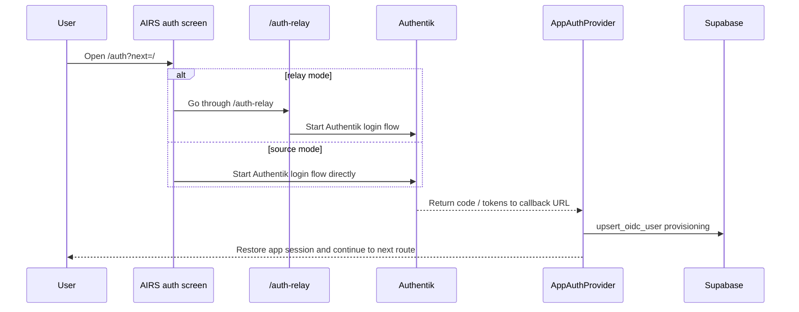

# Authentication and Session Flow

This page documents the current AIRS authentication path as it exists now: Authentik owns identity, Supabase owns application data and authorization, and the shared auth packages coordinate the browser flow between them.

The important design goal is simple:

- Authentik should be the visible identity layer for deployed web builds
- Supabase should remain the data and authorization layer
- the app should control the redirect and callback flow instead of depending on Authentik's user dashboard
- local development should stay flexible without making the deployed path ambiguous

## System Roles

The current auth stack is split across a few specific pieces:

- `apps/mobile` owns the public AIRS sign-in UI and route handling
- `@alternun/auth` owns the shared auth orchestration helpers and the mobile auth client wrapper
- `packages/infra` owns deploy-time auth environment wiring and pipeline policy
- Authentik is the OIDC provider and the identity boundary
- Supabase stores the app session data and remains the authorization/data layer

## Auth Modes

The login flow has two separate switches. They serve different purposes and should not be conflated.

### 1. Login entry mode

This controls the first visible hop when the user clicks a social login button.

- `relay` keeps the app as the visible entrypoint and routes through `/auth-relay`
- `source` jumps straight to Authentik's social source login route

The mode is controlled by `EXPO_PUBLIC_AUTHENTIK_LOGIN_ENTRY_MODE`.

### 2. Social login mode

This controls whether social login is Authentik-first, hybrid, or Supabase-only.

- `authentik` forces Authentik-only social login
- `hybrid` uses Authentik when configured and falls back to Supabase when needed
- `supabase` bypasses Authentik social login entirely

The mode is controlled by `EXPO_PUBLIC_AUTHENTIK_SOCIAL_LOGIN_MODE`.

### Current deployment policy

For deployed public builds, the infra pipeline sets `EXPO_PUBLIC_AUTHENTIK_SOCIAL_LOGIN_MODE=authentik`.

That means:

- testnet and production should not silently fall back to Supabase for Google or Discord
- the social buttons should remain Authentik-backed as long as the Authentik issuer and client ID are present
- local development can still opt into `hybrid` when a more permissive setup is useful

## Current Flow

At a high level, the auth round-trip looks like this:

### What the screen does

The mobile auth screen decides which path to use from the current env and runtime state:

- if the app is configured for `relay`, it sends the user to `/auth-relay`
- if the app is configured for `source`, it starts the Authentik login flow directly
- if the social login mode is `authentik`, Google and Discord stay on Authentik and do not fall back to Supabase
- if the social login mode is `hybrid`, Authentik is used when available and Supabase is the fallback
- if the social login mode is `supabase`, the Authentik social buttons are bypassed entirely

The relevant implementation lives in the auth helpers and the sign-in screen, not in a one-off app-local login branch.

## Callback And Session Restoration

The callback path is handled by the shared auth package and the app auth provider:

- `@alternun/auth` stores the pending OIDC state and processes the callback response
- `AppAuthProvider` reads the OIDC callback response, restores the session, and provisions the user into Supabase
- the callback URL can be derived from the browser origin when the explicit redirect URI is omitted in deployed web builds
- loopback hosts like `localhost` are treated as local-dev hints so the browser origin wins during development

That last point matters because it keeps local development from depending on a stale port-specific redirect URI.

## Logout And Session Clearing

Sign-out is not just a UI state reset. The app now clears both the app session and the Authentik session:

- the mobile auth client clears the local OIDC state
- the Authentik preset builds the end-session URL
- the browser is redirected through Authentik logout so the upstream session is actually cleared
- the logout response returns to the app instead of stopping on Authentik's success page

This is what prevents the user from getting stranded at the Authentik success page or re-entering the browser with a stale account session.

## Configuration Contract

These are the key env variables involved in the flow:

| Variable                                    | Purpose                                                           | Typical value                                                                           |
| ------------------------------------------- | ----------------------------------------------------------------- | --------------------------------------------------------------------------------------- |
| `EXPO_PUBLIC_AUTHENTIK_ISSUER`              | Authentik issuer URL for the app client                           | `https://testnet.sso.alternun.co/application/o/alternun-mobile/`                        |
| `EXPO_PUBLIC_AUTHENTIK_CLIENT_ID`           | Public OIDC client ID registered in Authentik                     | `alternun-mobile`                                                                       |
| `EXPO_PUBLIC_AUTHENTIK_REDIRECT_URI`        | Optional explicit callback URL                                    | usually injected by infra on deployed web builds, otherwise derived from browser origin |
| `EXPO_PUBLIC_AUTHENTIK_LOGIN_ENTRY_MODE`    | Relay vs direct source entry                                      | `relay` or `source`                                                                     |
| `EXPO_PUBLIC_AUTHENTIK_SOCIAL_LOGIN_MODE`   | Authentik vs hybrid vs Supabase-only social login                 | `authentik`, `hybrid`, or `supabase`                                                    |
| `EXPO_PUBLIC_AUTHENTIK_PROVIDER_FLOW_SLUGS` | Optional provider -> custom Authentik flow slug mapping           | JSON such as `{"google":"alternun-google-login"}`                                       |
| `INFRA_IDENTITY_GOOGLE_LOGIN_FLOW_SLUG`     | Infra-level knob that can generate the provider flow slug mapping | usually empty on the direct source-login path                                           |

Current operational rules:

- deployed testnet and production bundles should keep `EXPO_PUBLIC_AUTHENTIK_SOCIAL_LOGIN_MODE=authentik`
- local web can keep `hybrid` if a Supabase fallback is desirable while iterating
- custom Authentik source-stage slugs are optional, not required
- loopback local hosts ignore custom provider slugs and fall back to the direct source-login path

## Source Of Truth

If you need to modify the flow, start with these files:

- `packages/auth/src/mobile/authEntry.ts`
- `packages/auth/src/mobile/authentikUrls.ts`
- `packages/auth/src/mobile/authentikClient.ts`
- `apps/mobile/components/auth/AuthSignInScreen.tsx`
- `apps/mobile/app/auth-relay.tsx`
- `apps/mobile/components/auth/AppAuthProvider.tsx`
- `packages/infra/config/pipelines/specs/core.ts`
- `packages/infra/config/pipelines/specs/identity.ts`

## Troubleshooting

The common failures map to a small number of causes:

- if the Google or Discord buttons disappear on testnet, check the social login mode and the Authentik issuer/client ID env
- if testnet falls back to Supabase, the deployed bundle is usually stale or the social login mode is not set to `authentik`
- if localhost loops during auth, check the redirect URI handling and restart the local dev server so it picks up the latest shared auth package build
- if Authentik opens directly at `/if/user/`, that is the Authentik dashboard and not the AIRS app entrypoint

## Related Reading

- [Runtime Architecture](./runtime-architecture)
- [Infrastructure and Delivery](./infrastructure-and-delivery)
- [Security and Quality](./security-and-quality)
