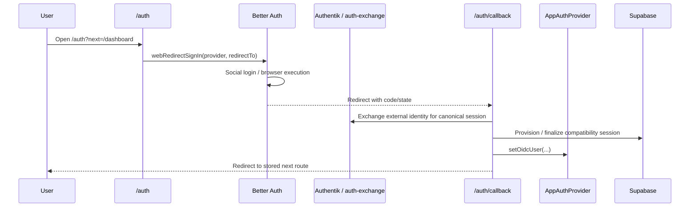
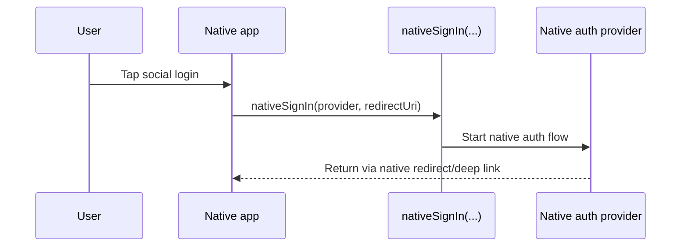

# Authentication and Session Flow

This is the current AIRS auth architecture.

It is intentionally split by runtime and execution layer:

- web uses a browser redirect flow with a dedicated callback route
- native uses the client runtime directly and stays separate from the web callback contract
- Better Auth can execute social login when selected by config
- Authentik owns the canonical issuer boundary
- Supabase owns application session persistence, app-user provisioning, data, and authorization for the compatibility path

The main rule is simple: deployed web builds should not silently drift between Authentik and Supabase because of hidden defaults.

## Responsibilities

### Better Auth

Better Auth is the execution layer when `AUTH_EXECUTION_PROVIDER=better-auth`.

It owns:

- browser social login execution
- the browser client flow on the API-origin `/auth` route
- provider-specific execution tokens before issuer exchange

It does **not** own the canonical AIRS session authority.

### Authentik

Authentik is the issuer boundary.

It owns:

- upstream social identity flows such as Google and Discord
- the OIDC authorization/code exchange boundary
- upstream logout and IdP session state
- identity-side app/provider configuration
- issuer-aligned session exchange for the canonical application session

It does **not** own the AIRS web callback page or AIRS route state.

### Supabase

Supabase is the application auth/data layer and legacy compatibility path.

It owns:

- the application session in the compatibility path
- app-user provisioning and synchronization
- row-level authorization and app data access
- email/password auth and wallet auth

For AIRS web social login, Supabase is not the visible identity broker. Authentik is the issuer boundary, and Better Auth can execute the browser sign-in when selected. When `AUTH_EXECUTION_PROVIDER=better-auth`, the browser still ends up with the canonical issuer-backed application session rather than a Better Auth cookie.

## Runtime Split

The shared auth package now exposes runtime-specific entry helpers instead of pretending every environment is the same.

### Web

Use browser redirects.

- `webRedirectSignIn(...)`
- callback route: `/auth/callback`

Web social login stores the intended destination, starts the selected execution provider, finalizes the callback on `/auth/callback`, then returns to the requested route.

When `AUTH_EXECUTION_PROVIDER=better-auth`, the browser client starts through the API-origin `/auth` route and the final application session is still resolved through the issuer exchange path.

### Native

Use native auth entry.

- `nativeSignIn(...)`

Native auth remains separate from the web callback route. It should use runtime-native redirect/deep-link behavior instead of borrowing browser callback assumptions.

### Popup support

Popup login is **not** part of the package contract.

If popup auth is added later, it should be implemented as a separate explicit API, not implied by a generic `signIn({ flow })` wrapper.

## Deployment Note

On the current testnet rollout, the user-facing bundle is deployed from `dev`, the live API/auth runtime is owned by `dashboard-dev`, and Authentik lives in `identity-dev`. `api-dev` is a backend-only escape hatch, not the owning stack for `testnet.api.alternun.co`.

## Shared Package Contract

The shared package surface lives in `@alternun/auth`.

The important pieces are:

- `packages/auth/src/mobile/runtimeSignIn.ts`
  - `webRedirectSignIn(...)`
  - `nativeSignIn(...)`
  - web callback URL helpers
  - return-target storage helpers
- `packages/auth/src/mobile/authentikUrls.ts`
  - issuer/client/redirect resolution
  - web callback URL defaults
- `packages/auth/src/mobile/authentikClient.ts`
  - Authentik OIDC start/finalize helpers
- `packages/auth/src/mobile/AlternunMobileAuthClient.ts`
  - runtime-aware client wrapper
  - browser runtime is now `web`, not `native`

The package contract is deliberately explicit:

- web social auth starts through `webRedirectSignIn(...)`
- native social auth starts through `nativeSignIn(...)`
- wallet/email flows keep using the app auth client directly

## Web Flow

The deployed AIRS web flow is:

Important implementation rules:

- `/auth` is the sign-in page, not the callback handler
- `/auth/callback` is the browser callback boundary
- callback finalization does not live in a UI button component
- the intended destination is stored explicitly and restored after success
- Better Auth execution tokens are not the final app session
- the issuer exchange remains the canonical session boundary

## Native Flow

Native auth is separate:

Native does not depend on the web callback page.

## Web Callback Route

The dedicated browser callback route is:

- `apps/mobile/app/auth/callback.tsx`

It is responsible for:

- receiving the redirect from Authentik
- finalizing the OIDC callback
- handling callback errors
- restoring the AIRS app session
- redirecting the browser to the intended destination

This is intentionally cleaner than embedding callback handling inside `AppAuthProvider` or the sign-in screen.

`AppAuthProvider` now handles session restoration and sign-out cleanup, while `/auth/callback` handles browser callback finalization.

## Entry Modes

When the Authentik-managed execution path is active, the package still supports two Authentik entry styles.

### `source`

Direct Authentik source login.

- shortest reliable path
- default for deployed bundles
- current testnet and production mode

### `relay`

App-owned relay entry through `/auth-relay`.

- opt-in only
- use when you deliberately want an app-controlled starter hop before Authentik

## Social Login Modes

`EXPO_PUBLIC_AUTHENTIK_SOCIAL_LOGIN_MODE` controls who owns social login:

- `authentik`
  - Authentik only
  - no silent Supabase social fallback
- `hybrid`
  - Authentik when configured
  - Supabase fallback only if Authentik is unavailable
- `supabase`
  - bypass Authentik social login entirely

For deployed AIRS web builds, the intended default is:

- `EXPO_PUBLIC_AUTHENTIK_LOGIN_ENTRY_MODE=source`
- `EXPO_PUBLIC_AUTHENTIK_SOCIAL_LOGIN_MODE=authentik`

## Redirect URI Contract

For web, the effective callback target is:

- `https://<airs-domain>/auth/callback`

That is now the default derived callback URL when the browser origin is available.

If an older env still points at the site root, the shared web resolver prefers the dedicated callback route on the same origin instead of staying on the stale root redirect.

When the browser is running on a local loopback origin, the active browser origin wins over stale testnet or localhost callback values so local testing stays on the current app instance.

For native, use an explicit runtime-appropriate redirect/deep-link URI.

## Custom Authentik Flow Slugs

Custom provider flow slugs are supported, but they are now explicit-only and gated behind an allow flag.

- `EXPO_PUBLIC_AUTHENTIK_ALLOW_CUSTOM_PROVIDER_FLOW_SLUGS`
- `EXPO_PUBLIC_AUTHENTIK_PROVIDER_FLOW_SLUGS`
- `INFRA_ALLOW_CUSTOM_AUTHENTIK_PROVIDER_FLOW_SLUGS`
- `INFRA_IDENTITY_GOOGLE_LOGIN_FLOW_SLUG`

If the allow flag is unset or false, AIRS uses the direct source-login path even if a custom slug is present.

There is no hidden automatic custom Google starter flow assumption anymore.

That matters because implicit source-stage flows were creating hard-to-debug loops and double handoffs between Authentik and Google.

## Current Deployed State

As of April 2026, the intended deployed AIRS web mode is:

- `EXPO_PUBLIC_AUTHENTIK_LOGIN_ENTRY_MODE=source`
- `EXPO_PUBLIC_AUTHENTIK_SOCIAL_LOGIN_MODE=authentik`
- `EXPO_PUBLIC_AUTHENTIK_PROVIDER_FLOW_SLUGS` empty
- `EXPO_PUBLIC_AUTHENTIK_ALLOW_CUSTOM_PROVIDER_FLOW_SLUGS` false
- `INFRA_ALLOW_CUSTOM_AUTHENTIK_PROVIDER_FLOW_SLUGS` false
- `INFRA_IDENTITY_GOOGLE_LOGIN_FLOW_SLUG` empty unless a custom starter flow is being tested deliberately
- the default internal application tile opens the stage-specific admin dashboard origin unless you override `INFRA_IDENTITY_DEFAULT_APPLICATION_LAUNCH_URL`
- the `Alternun Mobile` Authentik application tile uses a stage-specific launch URL that points at the AIRS auth entrypoint, so the user enters the app instead of staying on the Authentik library page

On the Authentik side, the expected direct-source configuration is:

- Google `authentication_flow = default-source-authentication`
- Google `enrollment_flow = default-source-enrollment`
- `default-source-authentication` must stay open and must not contain `UserLoginStage`
- `default-source-enrollment` must stay open and must not contain `UserLoginStage`
- Google enrollment should also bind a username-mapping policy on `default-source-enrollment-prompt` so the upstream Google email becomes the username automatically on first enrollment

If those login stages are present, Google can complete upstream auth but fail to resume the source flow cleanly, which shows up as loops or `token.flow` crashes instead of dashboard redirects.

For deployed AIRS web, custom outer starter flows such as `alternun-google-login` are not the default operating mode.

## Smoothing the Browser Flow

The current architecture reduces Authentik friction by keeping the browser path short:

- AIRS web starts from `/auth`
- Authentik uses direct source login by default
- web forces a fresh Authentik social session whenever social login is still Authentik-managed, so a stale shared SSO session does not apply the wrong user
- browser callback finalization happens on `/auth/callback`
- AIRS restores the intended destination after callback completion
- first-time Google enrollments should auto-fill the username from the upstream Google email instead of stopping on the Authentik username screen

That means the normal web path should be:

1. AIRS `/auth?next=...`
2. Authentik source login
3. Google or Discord
4. Authentik callback
5. AIRS `/auth/callback`
6. final AIRS route

If the browser bounces through additional Authentik flow screens before returning to AIRS, treat that as a regression and inspect the identity bootstrap state first.

## Known Failure Modes

These are the concrete regressions that have already happened in this repo:

- direct-source mode with `default-source-authentication` or `default-source-enrollment` still carrying `UserLoginStage`
- custom outer source-stage flow enabled in Authentik while the AIRS app bundle is already in direct-source mode
- AIRS bundle built from stale shared package output rather than current auth package source
- deployed or exported bundle still containing stale `/better-auth/*` web login paths
- web callback state handled inside UI components instead of a dedicated callback route
- local loopback redirect URIs leaking into deployed web assumptions
- hidden Authentik fallback behavior caused by `hybrid` social mode or stale emitted JS defaults

When debugging, verify the live browser bundle and the live Authentik source configuration together. Checking only env files is not enough.

## Configuration Contract

| Variable                                                 | Purpose                                          | Typical value                                                                  |
| -------------------------------------------------------- | ------------------------------------------------ | ------------------------------------------------------------------------------ |
| `EXPO_PUBLIC_AUTHENTIK_ISSUER`                           | Authentik issuer URL                             | `https://testnet.sso.alternun.co/application/o/alternun-mobile/`               |
| `EXPO_PUBLIC_AUTHENTIK_CLIENT_ID`                        | Public OIDC client ID                            | `alternun-mobile`                                                              |
| `EXPO_PUBLIC_AUTHENTIK_REDIRECT_URI`                     | Optional explicit callback URL                   | usually blank on deployed web; derived as `/auth/callback` from browser origin |
| `EXPO_PUBLIC_AUTHENTIK_LOGIN_ENTRY_MODE`                 | `source` or `relay`                              | `source`                                                                       |
| `EXPO_PUBLIC_AUTHENTIK_SOCIAL_LOGIN_MODE`                | `authentik`, `hybrid`, or `supabase`             | `authentik`                                                                    |
| `EXPO_PUBLIC_AUTHENTIK_PROVIDER_FLOW_SLUGS`              | Optional custom provider-flow JSON               | empty unless explicitly needed                                                 |
| `EXPO_PUBLIC_AUTHENTIK_ALLOW_CUSTOM_PROVIDER_FLOW_SLUGS` | Explicit opt-in for custom provider-flow slugs   | `false`                                                                        |
| `INFRA_ALLOW_CUSTOM_AUTHENTIK_PROVIDER_FLOW_SLUGS`       | Infra-side opt-in for custom provider-flow slugs | `false`                                                                        |

## Supabase Custom OIDC Checks

When Supabase is configured to trust Authentik as a custom OIDC provider, verify all three of these:

- the provider ID is the expected `custom:...` identifier
- Authentik uses the Supabase callback URI shown when the provider was created
- the app’s final `redirectTo` URL is allow-listed in Supabase URL configuration

Those checks matter for Supabase-side integrations, but they are separate from the AIRS web Authentik-first social entry flow.

## Source of Truth

If you need to change the current flow, start here:

- `packages/auth/src/mobile/runtimeSignIn.ts`
- `packages/auth/src/mobile/authentikUrls.ts`
- `packages/auth/src/mobile/authentikClient.ts`
- `packages/auth/src/mobile/AlternunMobileAuthClient.ts`
- `apps/mobile/app/auth.tsx`
- `apps/mobile/app/auth/callback.tsx`
- `apps/mobile/app/auth-relay.tsx`
- `apps/mobile/components/auth/AuthSignInScreen.tsx`
- `apps/mobile/components/auth/AppAuthProvider.tsx`
- `packages/infra/config/pipelines/specs/core.ts`
- `packages/infra/config/pipelines/specs/identity.ts`
- `packages/infra/modules/identity.ts`

## Troubleshooting

- If AIRS web shows the Supabase social path on testnet, check the deployed bundle env first, especially `EXPO_PUBLIC_AUTHENTIK_SOCIAL_LOGIN_MODE`.
- If Authentik shows "Flow does not apply to current user", the live source auth flow is stale or was re-locked. Redeploy identity so `default-source-authentication.authentication=none` is restored, then confirm the web build is still forcing a fresh Authentik-managed social session.
- If Google loops between Authentik and Google, check whether a custom provider flow slug is enabled unintentionally.
- If Authentik returns to the wrong place, check the effective redirect URI and make sure `/auth/callback` is allowed on the provider.
- If localhost behaves differently from testnet, confirm you are testing the web callback route and not a native-style redirect path.

## Related Reading

- [Runtime Architecture](./runtime-architecture)
- [Infrastructure and Delivery](./infrastructure-and-delivery)
- [Security and Quality](./security-and-quality)
