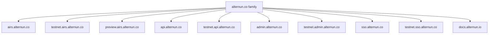
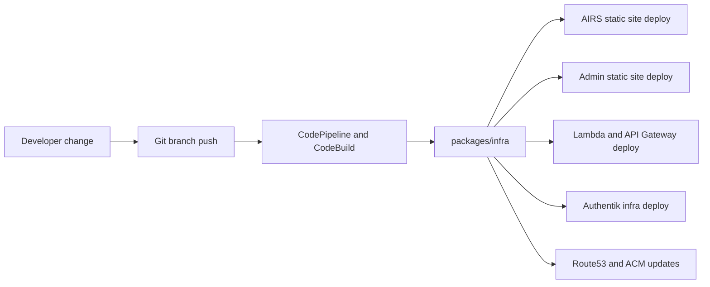

# Infrastructure and Delivery

Alternun provisions infrastructure from the monorepo through `packages/infra`.

The project uses:

- **SST** as the app wrapper and deployment entrypoint
- **Pulumi AWS resources** inside the infra modules
- **CodeBuild and CodePipeline** for managed delivery flows
- **Route53 and ACM** for DNS and certificates

## Stage Model

The platform is split into several deployment families.

### Public AIRS stages

- `production`
- `dev`
- `mobile`

Default public domains:

- `airs.alternun.co`
- `testnet.airs.alternun.co`
- `preview.airs.alternun.co`

### Backend and internal stages

- `dashboard-dev`
- `dashboard-prod`
- `api-dev`
- `api-prod`
- `admin-dev`
- `admin-prod`
- `identity-dev`
- `identity-prod`

These let the team deploy internal surfaces independently or as a combined release unit.

## Domain Model

The current domain family separates public product surfaces from marketing surfaces.

Notable detail:

- the public marketing/corporate site stays on `alternun.io`
- application and identity surfaces use the `alternun.co` domain family

## What The Infra Package Provisions

### Public app delivery

For AIRS, the infra package provisions:

- static site delivery for the Expo web build
- asset buckets
- CloudFront-backed distribution path
- stage-aware redirects

### Backend API delivery

For the custom API, the infra package provisions:

- Lambda
- API Gateway HTTP API
- CloudWatch logging
- custom domain mapping
- ACM and DNS validation when needed

### Admin delivery

For the admin console, the infra package provisions:

- static site hosting
- CDN distribution
- custom domains and certificates

### Identity delivery

For Authentik, the infra package provisions:

- VPC and security groups
- EC2 runtime host
- optional RDS PostgreSQL
- Secrets Manager payloads
- Route53 records
- ACME or ACM-backed TLS paths depending on stage

## Pipeline Model

The default pipeline catalog includes:

- `production`
- `dev`
- `identity-dev`
- `identity-prod`
- `dashboard-dev`
- `dashboard-prod`

The default branch map in the infra config sends dev-oriented stacks to `develop` and production-oriented stacks to `master`.

## Delivery Flow

## Why There Are Combined And Dedicated Stacks

The infra system supports both:

- **combined dashboard stacks** for admin and API together
- **dedicated escape-hatch stacks** for manual API-only or admin-only operations

That design is pragmatic:

- it keeps normal releases simpler
- it still allows controlled component-specific deployment paths
- it reduces accidental deletion risk by putting safety guards into the infra logic

## Practical Source Of Truth

If you want the live infra definitions, read these files in this order:

1. `packages/infra/infra.config.ts`
2. `packages/infra/config/infrastructure-specs.ts`
3. `packages/infra/modules/*`
4. `packages/infra/INFRASTRUCTURE_SPECS.md`

The public docs here summarize those sources for human understanding, but the code remains the actual source of truth.
