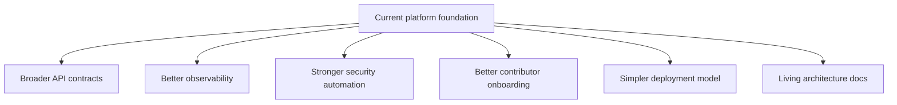

# Next Improvements

This page documents the most important next steps for the platform from an engineering point of view.

It is intentionally practical. The goal is not to describe a perfect future-state diagram, but to identify the next improvements that would materially strengthen the platform.

## 1. Expand The Custom API Carefully

The NestJS API should continue to grow, but not by becoming a rushed dumping ground for logic.

High-value next steps:

- add more domain endpoints with documented DTOs and auth guards
- expand OpenAPI coverage so the backend contract is public and reviewable
- add stronger integration tests for auth, health, and operational flows
- tighten CORS to explicit allowed origins per environment

## 2. Mature The AIRS Runtime Contract

The public AIRS app already carries meaningful product responsibility. The next step is to make its backend and identity contract more explicit.

Suggested improvements:

- document stable client-to-service contracts
- clarify which concerns belong in Supabase versus the custom API
- standardize role and claim handling across app surfaces
- document wallet-related trust and fallback behavior more clearly

## 3. Improve Infrastructure Observability

The infra package already deploys the platform, but visibility into runtime health can improve.

Suggested improvements:

- stage dashboards for API, identity, and static delivery
- deployment summaries with direct links to health and docs endpoints
- structured application logs and trace correlation
- explicit alerting for key identity and API failures

## 4. Harden Security Automation

Useful next controls would include:

- stricter dependency review workflow
- automated SBOM generation for release artifacts
- scheduled vulnerability reporting beyond basic audit commands
- stronger secret handling verification in CI
- a public security.md process for coordinated reporting

## 5. Reduce Deployment Complexity

The current stack model is powerful, but some stage alias behavior and ownership boundaries are still easy to misunderstand.

Good next steps:

- simplify stage naming rules where possible
- make combined versus dedicated stack ownership easier to reason about
- document all deploy-safe paths in one canonical page
- add more automated checks for stack alias collisions and route overlap

## 6. Improve Open-Source Onboarding

For public contributors, the repo still needs a smoother first-hour experience.

Suggested improvements:

- add a contributor-first architecture quickstart
- publish a "how to run the main surfaces locally" page
- document expected environment variables per app
- maintain an index of architecture decision records

## 7. Keep The Docs As A First-Class Surface

The docs should remain synchronized with the codebase rather than becoming a stale explanation layer.

Recommended habits:

- update docs when deployment model changes
- update docs when auth boundaries change
- document new public APIs as part of implementation, not later
- keep Mermaid diagrams close to the current runtime, not future guesses

## Improvement Map

## Final Note

The most useful improvements are the ones that reduce ambiguity.

In this repo, that usually means:

- make boundaries clearer
- make deployments safer
- make contracts more explicit
- make documentation easier to trust
