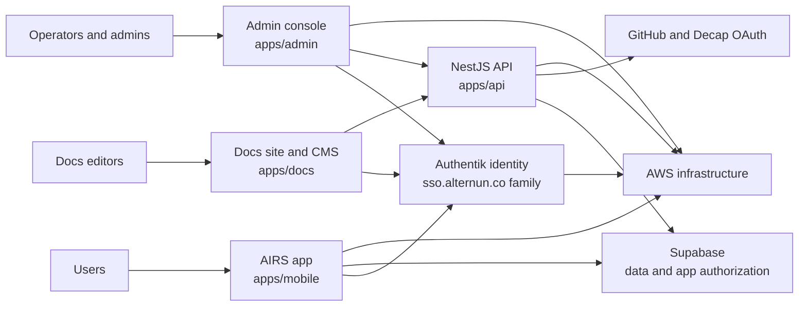

# Alternun and AIRS Architecture

This section is the public technical map of the Alternun platform.

It is written for:

- users who want to understand how the product is assembled
- new engineers joining the project
- external contributors reading the monorepo for the first time
- open-source community members who want a clear system description before going into the code

## What is Alternun?

Alternun is the broader product and infrastructure umbrella.

Today the repo contains several connected surfaces:

- **AIRS**: the public application experience delivered from the Expo-based client stack
- **Admin**: the internal operational console for managed workflows
- **API**: the custom backend service used for operational and integration endpoints
- **Identity**: the Authentik-based authentication and OIDC layer
- **Docs**: the public Docusaurus documentation site and protected CMS editor
- **Infra**: the SST and Pulumi code that provisions AWS resources and deployment pipelines

## What is AIRS?

AIRS is the current user-facing application surface under the `airs.alternun.co` domain family.

In practical terms, AIRS is the part of the system that end users interact with first:

- onboarding and marketing-like experience inside the Expo web app
- authentication and session handling
- user dashboard concepts such as AIRS balance, portfolio, and impact-related activity
- mobile and web delivery from one shared application codebase

## System At A Glance

## Architectural Principles

The monorepo currently follows a few practical principles:

1. **One repository, multiple delivery surfaces.** Public app, admin, docs, API, and infrastructure live together so shared changes can be coordinated.
2. **Shared building blocks before duplicated logic.** Authentication, i18n, UI, and email templates are split into reusable packages.
3. **Environment-aware delivery.** The project ships different stacks for production, dev/testnet, preview/mobile, dashboard, and identity.
4. **Infrastructure as code first.** AWS resources, domains, pipelines, redirects, and runtime defaults are defined in `packages/infra`.
5. **Hybrid backend model.** The platform currently combines managed services such as Supabase with a growing custom NestJS backend.

## The Three Main Planes

### 1. Product Plane

This is what end users and community members experience:

- AIRS public app
- account and wallet entry points
- user dashboard and impact-related interfaces
- multilingual content and email touchpoints

### 2. Operations Plane

This is where internal teams work:

- admin console
- docs editing workflow
- backend operational endpoints
- pipeline-driven deployments

### 3. Platform Plane

This is the foundation layer:

- identity
- DNS
- certificates
- static hosting
- Lambda and API Gateway
- EC2 and RDS for Authentik
- CodeBuild and CodePipeline driven delivery

## Current State

The repo is already structured like a platform, but not every subsystem is equally mature.

What is already clear and active:

- public AIRS app delivery
- AWS-managed deployment topology
- Authentik-based identity direction
- Docusaurus docs and Decap editing flow
- admin and API deployment stacks

What is still growing:

- broader custom API surface
- deeper observability
- stronger automated security and regression coverage
- more public developer-facing architecture notes

## Read This Section In Order

For the clearest onboarding path:

1. Start with [Monorepo and Stack](./monorepo-and-stack.md)
2. Continue to [Runtime Architecture](./runtime-architecture.md)
3. Then read [Infrastructure and Delivery](./infrastructure-and-delivery.md)
4. Finish with [Security and Quality](./security-and-quality.md) and [Next Improvements](./next-improvements.md)
