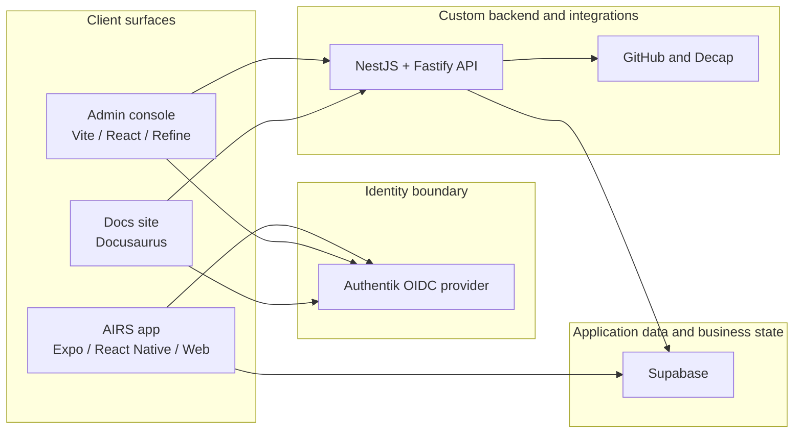
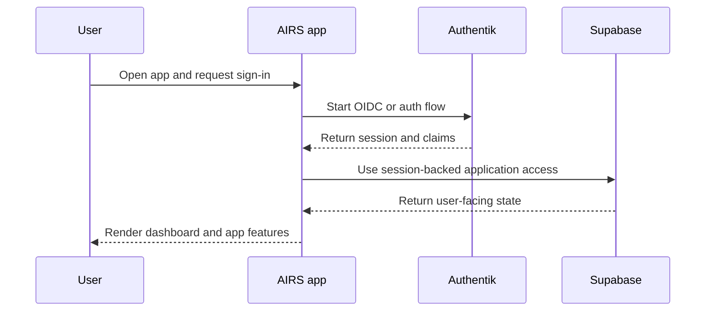
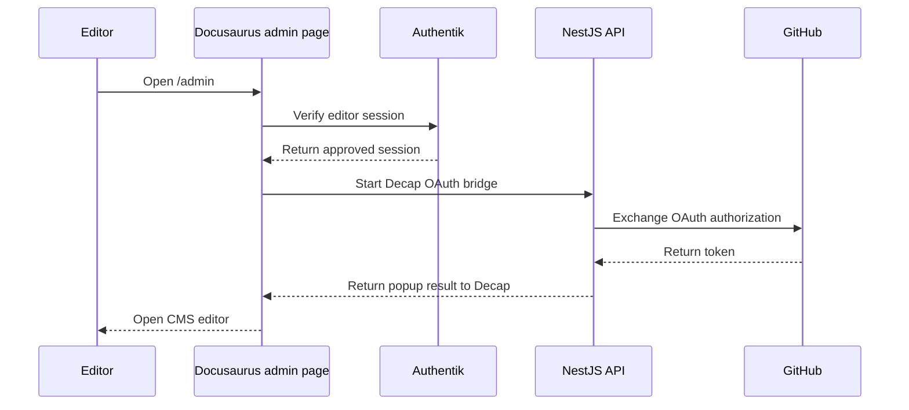

# Runtime Architecture

The running system is a combination of client applications, managed services, and AWS-hosted custom services.

The simplest way to understand it is to follow the trust boundaries.

## Runtime Topology

## Trust Model

The repo's current identity direction is:

- Authentik is the identity provider and OIDC source of truth
- Supabase remains an application data and authorization layer
- custom backend capabilities live in the NestJS API

This creates a hybrid runtime model:

- identity is not owned by the frontend
- core product data is not hard-coded into the API
- some workflows remain service-driven while the custom API grows over time

## AIRS Runtime

For AIRS, the current runtime is centered on the Expo app:

- the same app family supports mobile-native behavior and web publishing
- authentication is abstracted through the shared auth package
- Supabase is already part of the client-side integration model
- wallet-related behavior is present in the public app stack

In other words, AIRS is not just a static marketing frontend. It is the beginning of the actual application runtime.

## Admin Runtime

The admin console is intentionally separate from the public AIRS app:

- it has its own deployment target
- it uses OIDC flows through Authentik
- it is designed for internal and operational use
- it can be shipped together with the custom API in combined dashboard stacks

That separation reduces accidental coupling between public user journeys and internal operator workflows.

## Documentation Runtime

The docs system has two modes:

1. public documentation delivery through Docusaurus
2. protected editorial workflow through Decap CMS plus Authentik gating

That means the docs are treated as a real product surface with authentication, content workflow, and infrastructure dependencies, not just a static folder of markdown files.

## Example Flow: AIRS Sign-In

## Example Flow: Docs Editing

## What Lives Where Today

### Mostly client-driven today

- AIRS UI rendering
- app-side session handling
- multilingual presentation
- user journey and interface composition

### Mostly service-driven today

- identity
- infrastructure provisioning
- deployment pipelines
- documentation publishing

### Growing custom backend area

- NestJS operational API
- OpenAPI documentation
- integration glue such as OAuth bridge endpoints
- future backend domain logic that should not stay in clients

## Important Architectural Reality

This repo is not yet a "single backend owns everything" architecture.

It is a platform in transition:

- some capabilities are already centralized
- some are intentionally delegated to managed services
- some are still moving from client-side patterns into dedicated backend services

That is not a problem by itself, but it is important for contributors to understand before proposing large refactors.
