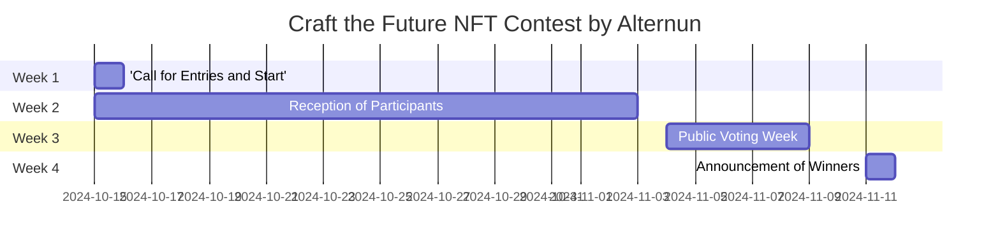

# General-internal

## Contest Objective
Promote the creation of unique art pieces that graphically explain the mission and operation of Alternun, generating interest in the tokenization of real assets.

## Contest Schedule

| Phase                      | Dates                    |
| -------------------------- | ------------------------ |
| Call for Entries and Start | October 15               |
| Reception of Participants  | October 15 - November 3  |
| Public Voting Week         | November 4 -  November 8 |
| Announcement of Winners    | November 11              |

## Prizes

| Position                       | Artist Selected                     | Amount(USD) |
| ------------------------------ | ----------------------------------- | ----------- |
| 1st place                      | 1 artist selected by community      | $200        |
| 2nd place                      | 1 artists selected by the community | $100        |
| 3rd place                      | 1 artists selected by the community | $50         |
| Criteria for social engagement | Top 17 artist                       | $10 each    |

*All participants will gain valuable experience that will be taken into account in TGE via Zealy.

## Detailed Plan

### 1. Preparation (Before October 15)
- **Define the key message**: Develop a clear description of the mission and operation of Alternun that artists should reflect in their works.
- **Create a brief**: Include design requirements, NFT size, format, and themes to be addressed.
- **Design promotional graphics**: Create promotional graphics for social media.

### 2. Launch of the Call for Entries (October 15)
- **Instagram**:
  - Post an attractive post with graphics.
  - Interactive stories (polls about what followers think of the tokenization of assets).
  - Use relevant hashtags (#NFTArt, #TokenizationOfAssets, #AlternunArt).
  
- **Twitter**:
  - Initial tweet with a thread explaining the contest.
  - Share the Instagram post and a link to the Alternun site.
  - Daily tweet with reminders and tips for participation.
  
- **LinkedIn**:
  - Detailed post about the mission of Alternun and how art can help communicate it.
  - Invite the community to participate and share their works.

### 3. Reception of Participants (October 15 - October 25)
- **Reception Channels**:
  - Create a Google form for artists to submit their works.
  - Indicate that works must be submitted as links to NFTs or digital files.
  
- **Ongoing Promotion**:
  - Weekly reminders on social media.
  - Stories and tweets showcasing highlighted works (if possible).

### 4. Public Voting Week (October 28 - November 1)
- **Voting**:
  - Publish the received works in a virtual gallery on the Alternun website.
  - Create a voting system (Google Forms or online voting tools).
  
- **Promotion of Voting**:
  - Daily posts on Instagram and Twitter to remind the community to vote.
  - Create a hashtag campaign to encourage participation.

### 5. Announcement of Winners

## Considerations Adicionales
- **Colaboraciones**: Considerar colaborar con influencers del mundo del arte y NFT para mayor visibilidad.
- **Comunicaciones**: Mantener una comunicación constante con los participantes durante todo el proceso.
- **Feedback**: Pedir feedback de los participantes y votantes después del concurso para mejorar futuras ediciones.
