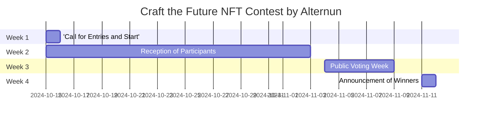

# General

## Contest Objective
Promote the creation of unique art pieces that graphically explain the mission and operation of Alternun, generating interest in the tokenization of real assets.

## Contest Schedule

| Phase                      | Dates                    |
| -------------------------- | ------------------------ |
| Call for Entries and Start | October 15               |
| Reception of Participants  | October 15 - November 3  |
| Public Voting Week         | November 4 -  November 8 |
| Announcement of Winners    | November 11              |

## Prizes

| Position                       | Artist Selected                     | Amount(USD) |
| ------------------------------ | ----------------------------------- | ----------- |
| 1st place                      | 1 artist selected by community      | $200        |
| 2nd place                      | 1 artists selected by the community | $100        |
| 3rd place                      | 1 artists selected by the community | $50         |
| Criteria for social engagement | Top 17 artist                       | $10 each    |

*All participants will gain valuable experience that will be taken into account in TGE via Zealy.

# Registration Guide

## Step-by-Step Registration Process

1. **Fill Out the Form on Zealy**
   - Visit the Zealy platform.
   - Complete the form by providing your **name** and **email address**.
  

  
Register Form

  https://zealy.io/cw/alternun/questboard/c7da4780-1ad0-4ad8-8cb8-affbcff91ab2/1a7427e2-4ac4-4d0f-abb2-23ad8e19e456

1. **Receive the Guide in Your Email**
   - After submitting the form, check your email.
   - You will receive an email with instructions on how to mount the link to your NFT in the gallery and on your preferred blockchain.

2. **Mount Your NFT**
   - Follow the instructions provided in the email to upload your artwork to the gallery and link it to the blockchain of your choice.

3. **Artist Selection Campaign**
   - Participate in the Zealy campaign, where the **top 20 artists** will be selected through public voting.

4. **Stay Informed About the Dates**
   - Make sure to meet the submission deadlines (from October 15 to November 3) and the voting week (from November 4 to November 8).

## Art Style Guide
- There are no restrictions on the type of art you can submit; you may use video, GIF, or images.
- However, please do not include any isotypes or logos from Alternun in your artwork.
- All submitted art must be posted in a gallery, such as OpenSea or another blockchain gallery.

## Good Luck!

We look forward to seeing your art in the contest and how you contribute to redefining the future of digital mining and DeFi projects through NFT art.

### Public Voting Week (November 4 - November 1)
- **Voting**:
  - Publish top3 received works in a virtual gallery on the Alternun website.
  - voting system via Alternun
  
- **Promotion of Voting**:
  - Daily posts on Instagram and Twitter to remind the community to vote.
  - Create a hashtag campaign to encourage participation.

### Announcement of Winners

November 11

