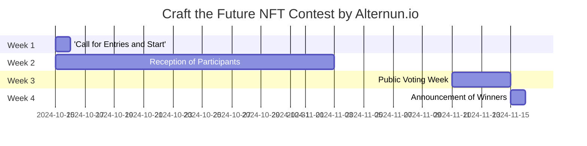

# General

## Contest Objective

Promote the creation of unique art pieces that graphically explain the mission and operation of Alternun, generating interest in the tokenization of real assets.

## Contest Schedule

| Phase                      | Dates                     |
| -------------------------- | ------------------------- |
| Call for Entries and Start | October 15                |
| Reception of Participants  | October 15 - November 11  |
| Public Voting Week         | November 11 - November 15 |
| Announcement of Winners    | November 15               |

## Prizes

| Position                       | Artist Selected                     | Amount(USD) |
| ------------------------------ | ----------------------------------- | ----------- |
| 1st place                      | 1 artist selected by community      | $200        |
| 2nd place                      | 1 artists selected by the community | $100        |
| 3rd place                      | 1 artists selected by the community | $50         |
| Criteria for social engagement | Top 17 artist                       | $10 (Each)  |

:::info
All participants will gain valuable experience that will be taken into account in Alternun Token Generation Event (TGE Q1 2025) via Zealy. \
All prizes will be distributed in $XLM Stellar Blockchain native cryptocurrency USD equivalent. \
[Stellar Info](https://stellarchain.io/)
:::

# Registration Guide

:::danger
**Important:** Registration for artists will close at **11:11 PM EST on November 11**. Make sure to complete your registration before this deadline!
:::

## Eligibility Criteria

- Participants must be at least 18 years old.
- Participants should have a valid Zealy account.
- All submissions must be original artwork created by the participant.
- Participants must complete the registration form to be eligible for selection.

## Step-by-Step Registration Process

:::tip
Make sure to connect to Discord to fill out the registration form.
:::

1. **Fill Out the Registration Form**
   - Join our community at [Zealy 🔗](https://zealy.io/cw/alternun/invite/TTVWe--hMN2Y3N-ibl-XV).
   - Complete the artist registry form. [🔗](https://zealy.io/cw/alternun/questboard/c7da4780-1ad0-4ad8-8cb8-affbcff91ab2/1a7427e2-4ac4-4d0f-abb2-23ad8e19e456)
   - **Simplified Registration**: You can also register by simply providing your email at [this link](https://xozsu5eiys2.typeform.com/to/MuDsJSqh). Please note that on the submition pashe of your artwork, you must also follow us on Twitter and Discord via Zealy.
2. **Receive the Guide in Your Email**

   - After submitting the form, check your email.
   - You will receive an email with instructions on how to mount the link to your NFT in the gallery and on your preferred blockchain.

3. **Mount Your NFT**

   - Follow the instructions provided in the email to upload your artwork to the gallery and link it to the blockchain of your choice.

4. **Artist Selection Campaign**
   - Participate in the Zealy campaign, where the **top 17 artists** will be selected through public voting.
   - The community selection process involves completing Zealy quests that encourage social media engagement. Participants can earn points by sharing their artwork and engaging with the community on various platforms.
   - Additionally, artists are encouraged to learn from the Alternun documentation and complete process quizzes to better understand the project and enhance their submissions.

## Art Style Guide and Submission Requirements

- There are no restrictions on the type of art you can submit; you may use video, GIF, or images.
- However, please do not include any isotypes or logos from Alternun in your artwork.
- All submitted art must be posted in a gallery, such as OpenSea or another blockchain gallery.
- The use of AI tools for generating art is allowed, but make sure to infuse your soul into the process.
- Submission format must be 1:1 with a minimum resolution of 2400px.
- You must submit a minimum of one graphic piece and a maximum of 3 as an NFT series.
- For inspiration, visit the contest landing page at [craft-the-future.alternun.io](https://craft-the-future.alternun.io).

:::warning

- All submissions must not contain any racist, violent, or sexually explicit content. We encourage creativity while ensuring a respectful and inclusive environment for all participants.
  :::

## Intellectual Property and Rights

- the intellectual and commercial rights of the NFT are the property of the artist.
- The artist grants Alternun authorization to use the work in Alternun's own publications and on our sites, always acknowledging the author.

## Wallet Recommendation

To receive prizes on the Stellar blockchain, we recommend installing the LOBSTR wallet

:::info
[⏬ LOBSTR Wallet ](https://lobstr.co/)
:::

LOBSTR is a user-friendly and secure wallet for managing your Stellar assets, including XLM. It offers features such as:

- Simple and intuitive interface
- Google 2FA
- Support for Stellar assets
- PIN and fingerprint security
- Live charts
- QR code support
- Push notifications for transactions
- Secure data storage

## Good Luck!

We look forward to seeing your art in the contest and how you contribute to redefining the future of digital mining and DeFi projects through NFT art.

### Public Voting Week ( November 8 - November 11)

- **Voting Process**:
  - Publish top3 received works in a virtual gallery on the Alternun website.
  - voting system via Alternun DAO
- **Promotion of Voting**:
  - Daily posts on Instagram and Twitter to remind the community to vote.
  - Create a hashtag campaign to encourage participation.

### Announcement of Winners

November 15 Via Alternun X

:::info

## Top 3 Artist Winners

1️⃣ @iledesignia - 52 likes  
2️⃣ @SandRamp - 33 likes  
3️⃣ @39eliens - 25 likes

## Congratulations to All Artists!

A big thank you to all artists who submitted their artwork! Your creativity and effort are truly appreciated. Stay tuned for more updates and opportunities from the community!
:::
