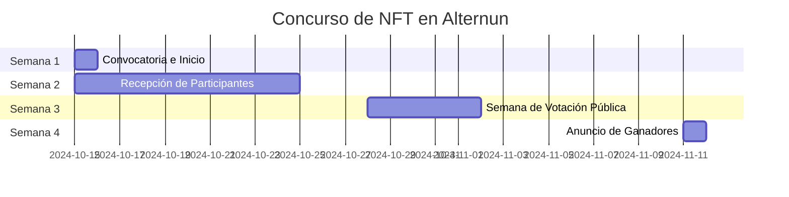

# General

## Objetivo del Concurso
Promover la creación de piezas de arte únicas que expliquen gráficamente la misión y operación de Alternun, generando interés en la tokenización de activos reales.

## Cronograma del Concurso

| Fase                          | Fechas                          |
|-------------------------------|---------------------------------|
| Convocatoria e Inicio         | 15 de octubre                   |
| Recepción de Participantes     | 15 de octubre - 25 de octubre   |
| Semana de Votación Pública    | 28 de octubre - 1 de noviembre  |
| Anuncio de Ganadores          | 11 de noviembre                 |

## Presupuesto

| Artista                          | Monto  |
|----------------------------------|--------|
| 1 artista seleccionado por Alternun | $300   |
| 2 artistas seleccionados por la comunidad | $100 (cada uno) |

## Plan Detallado

### 1. Preparación (Antes del 15 de octubre)
- **Definir el mensaje clave**: Elaborar una descripción clara de la misión y operación de Alternun que los artistas deben reflejar en sus obras.
- **Crear un brief**: Incluir requisitos de diseño, tamaño del NFT, formato, y temas a abordar.
- **Diseñar imágenes gráficas**: Crear gráficos promocionales para redes sociales.

### 2. Lanzamiento de la Convocatoria (15 de octubre)
- **Instagram**:
  - Publicación de un post atractivo con gráficos.
  - Historias interactivas (encuestas sobre qué piensan los seguidores de la tokenización de activos).
  - Uso de hashtags relevantes (#NFTArt, #TokenizacionDeActivos, #AlternunArt).
  
- **Twitter**:
  - Tweet inicial con un hilo explicando el concurso.
  - Compartir el post de Instagram y un enlace al sitio de Alternun.
  - Tweet diario con recordatorios y tips para participar.
  
- **LinkedIn**:
  - Publicación detallada sobre la misión de Alternun y cómo el arte puede ayudar a comunicarla.
  - Invitar a la comunidad a participar y compartir sus obras.

### 3. Recepción de Participantes (15 de octubre - 25 de octubre)
- **Canales de Recepción**:
  - Crear un formulario de Google para que los artistas envíen sus obras.
  - Indicar que las obras deben ser enviadas como enlaces a NFT o archivos digitales.
  
- **Promoción Continua**:
  - Recordatorios semanales en redes sociales.
  - Historias y tweets que muestren obras destacadas (si es posible).

### 4. Semana de Votación Pública (28 de octubre - 1 de noviembre)
- **Votación**:
  - Publicar las obras recibidas en una galería virtual en el sitio web de Alternun.
  - Crear un sistema de votación (Google Forms o herramientas de votación online).
  
- **Promoción de la Votación**:
  - Post diario en Instagram y Twitter para recordar a la comunidad que vote.
  - Crear una campaña de hashtags para fomentar la participación.

### 5. Anuncio de Ganadores (11 de noviembre)
- **Publicación**:
  - Anunciar los ganadores en todas las plataformas sociales.
  - Compartir las obras ganadoras y explicar brevemente por qué fueron seleccionadas.
  
- **Celebración**:
  - Realizar un live en Instagram o un evento en línea donde se muestren las obras y se hable de la tokenización de activos.

## Consideraciones Adicionales
- **Colaboraciones**: Considerar colaborar con influencers del mundo del arte y NFT para mayor visibilidad.
- **Comunicaciones**: Mantener una comunicación constante con los participantes durante todo el proceso.
- **Feedback**: Pedir feedback de los participantes y votantes después del concurso para mejorar futuras ediciones.
