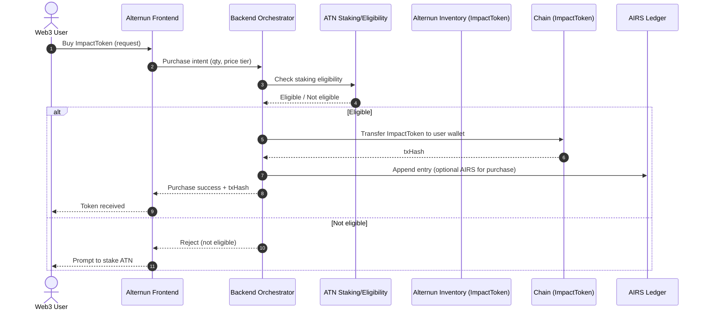
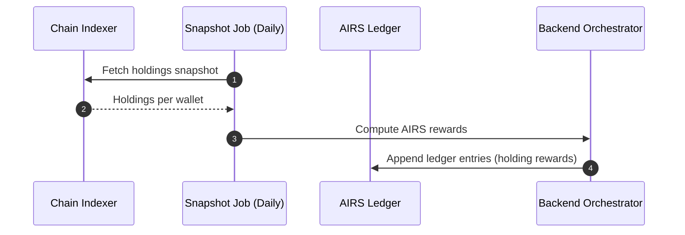
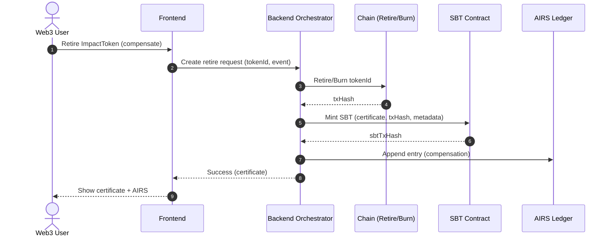
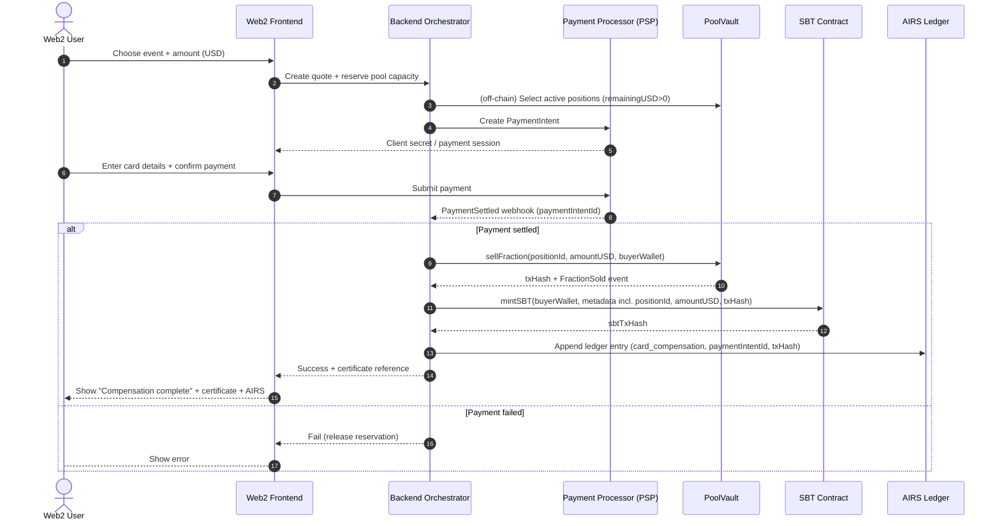
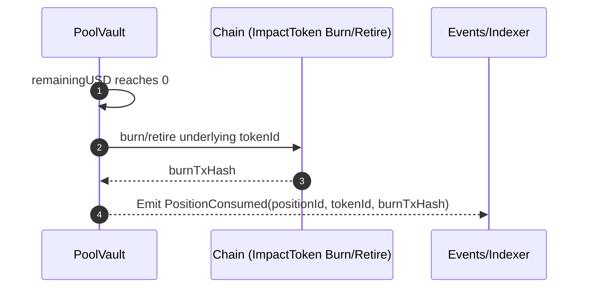
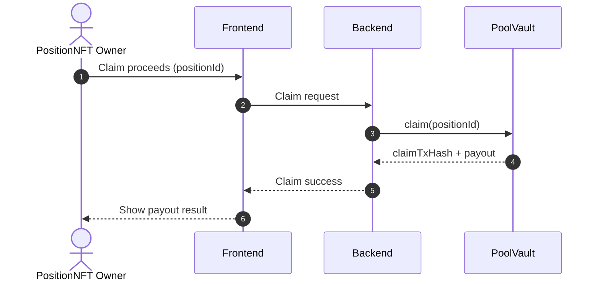

# AIRS + Impact Token Pool – Unified System Specification

## v1.0 (Unified) – Dev Review Draft

**Project:** Alternun  
**Purpose:** Single source of truth for (1) Web3 ImpactToken lifecycle + Pool micronization and (2) Web2 credit-card micro-compensations sourced exclusively from PoolVault.

---

# 0. Goals (What we must guarantee)

1. **Transferable asset before pool deposit.**
2. **Micronization happens exclusively inside PoolVault.**
3. **When a token is fully sold via the pool, it is irreversibly consumed (burn/retire).**
4. **No double-use:** a compensation unit cannot be used or sold twice.
5. **Web2 UX:** credit-card buyers see compensation + certificate with zero Web3 complexity.
6. **Web3 UX:** users can buy full tokens, hold them, transfer them, or deposit them to pool and earn proceeds.
7. **AIRS ledger is append-only and auditable.**

---

# 1. Core Concepts & Entities

## 1.1 ImpactToken (Transferable Compensation Asset)

A token representing a compensation unit acquired by Alternun from a foundation (often at discount) and optionally sold to Web3 users.

**Properties**

- Transferable between wallets while in **Free** state.
- Can be:
  - held (earning AIRS by holding, optional)
  - transferred (sold/gifted)
  - deposited into PoolVault for micronization
  - consumed directly (retire/burn) **outside pool** (optional path, for Web3 users)

ImpactToken has **no** fractional logic.

---

## 1.2 PoolVault (Micronization + Custody + Consumption)

A smart contract that:

- Custodies deposited ImpactTokens.
- Sells fractions (micronization) to buyers.
- When fully sold, consumes the underlying ImpactToken (burn/retire).
- Emits events for dashboards & audit.
- Enables proceeds to the depositor via PositionNFT ownership.

PoolVault is the **single point** where "fraction sold" is possible.

---

## 1.3 PositionNFT (Transferable Economic Right)

Minted when an ImpactToken is deposited into PoolVault.

Represents:

- Economic ownership of the deposited token position.
- Right to receive principal + profit share when fractions are sold.
- Transferable freely (so user can "sell/gift" their economic claim after deposit).

PositionNFT does **not** represent the underlying ImpactToken itself.

---

## 1.4 SBT (Soulbound Certificate / "POAP" UX)

A soulbound certificate minted upon **effective compensation** (i.e., a fraction purchase is executed and anchored on-chain, and/or the underlying token is consumed).

Metadata typically includes:

- positionId (if sourced from pool)
- tokenId (underlying ImpactToken)
- amountUSD (or impact units)
- timestamp
- onChain references (txHash)
- optional: retirement reference if the token is fully consumed

---

## 1.5 AIRS Ledger (Off-chain, Append-only)

AIRS is tracked as an auditable ledger:

- append-only entries
- each entry includes: `referenceType`, `referenceId`, `onChainReference`, `timestamp`, `amount`, `reason/source`

AIRS can be generated by:

1. Buying ImpactToken (optional)
2. Holding ImpactToken (snapshot-based, optional)
3. Completing compensations (micro or direct)
4. Other ecosystem actions (future)

---

# 2. Token Lifecycle States (Single source of truth)

ImpactToken state is determined by custody/ownership:

## State A – Free (Transferable)

- Token is in a user wallet (or Alternun inventory wallet).
- Transferable.
- Can be deposited to pool or retired directly (optional).

## State B – Deposited in Pool (Locked)

- Token is custodied by PoolVault.
- Not transferable (because it is not in user wallet).
- Can only be fraction-sold and ultimately consumed.

## State C – Consumed (Irreversible)

- Token is burned/retired by PoolVault (or by a direct retire path).
- Cannot be transferred or used again.
- Compensation certificates are minted to buyers.

---

# 3. Economic Model (Example)

Foundation base price: **30 USD**  
Alternun acquisition (30% discount): **21 USD**  
Alternun sale to Web3 user (passes 10% of discount): **27 USD**  
Retail price via pool micronization: **45 USD**

Gross profit: **45 - 27 = 18 USD**  
User share (30% of profit): **5.4 USD**  
User payout when fully sold: **27 + 5.4 = 32.4 USD**

:::note
Fees (payment processing, protocol fees) can be applied before profit split. Define later.
:::

---

# 4. Smart Contract Surface (MVP)

## 4.1 ImpactToken

- Standard transferability while Free.
- Minimal: mint/transfer (or import via bridge/wrap later).

## 4.2 PoolVault + PositionNFT (may be embedded)

Required functions (conceptual):

- `deposit(tokenId, costBasis, totalValueUSD, profitShareBps) -> positionId + PositionNFT`
- `sellFraction(positionId, amountUSD, buyerWallet) -> emits FractionSold`
- `consume(positionId) -> burns/retire underlying token, closes position`
- `claim(positionId) -> pays PositionNFT owner their claimable`
- View functions: `getPosition(positionId)`

## 4.3 SBT Contract

- `mintSBT(toWallet, metadataURI or structured metadata)`
- Optional: `revokeSBT` (for disputed cases) or mint "revocation SBT"

---

# 5. Web3 User Flows

## 5.1 Buy Full ImpactToken (Discount gated by ATN staking)

**Precondition:** User meets ATN staking requirement (gating handled off-chain or via contract check).

Steps:

1. User purchases ImpactToken from Alternun at discounted price.
2. Record purchaseTxHash and purchasePrice.
3. Optional: Credit AIRS for purchase action.

### Sequence Diagram – Web3 Full Token Purchase



---

## 5.2 Hold ImpactToken (Earn AIRS by holding – optional)

Mechanism:

- Daily snapshot (or periodic) of holdings.
- Append AIRS entries based on holdings.

### Sequence Diagram – Snapshot-based AIRS



---

## 5.3 Direct Compensation (Retire/Burn outside pool – optional path)

1. User calls retire/burn for tokenId (or sends to Retire contract).
2. Token is irreversibly consumed.
3. Mint SBT certificate.
4. Append AIRS compensation entry.

### Sequence Diagram – Direct Retire



---

## 5.4 Deposit Token into Pool (for micronization)

1. User deposits ImpactToken into PoolVault.
2. PoolVault locks token and mints PositionNFT.
3. User can transfer/sell the PositionNFT freely.

### Sequence Diagram – Deposit to Pool

```mermaid
sequenceDiagram
  autonumber
  actor U as Web3 User
  participant FE as Frontend
  participant BE as Backend Orchestrator
  participant PV as PoolVault
  participant CH as Chain (ImpactToken)
  participant NFT as PositionNFT

  U->>FE: Deposit token into pool
  FE->>BE: Deposit request (tokenId, costBasis, profitShare)
  BE->>CH: Approve PoolVault transfer (if needed)
  BE->>PV: deposit(tokenId, costBasis, totalValueUSD, profitShare)
  PV-->>BE: positionId + txHash
  PV->>NFT: Mint PositionNFT to user
  BE-->>FE: Deposit success (positionId)
  FE-->>U: PositionNFT received; token locked in pool
```

---

# 6. Web2 Credit Card Micro-Compensation Flow (Pool-exclusive sourcing)

**Key rule:** The fraction bought by a credit-card user is sourced **exclusively** from PoolVault positions.  
No direct retirement path is used in this flow.

## 6.1 End-to-End Steps

1. Web2 user selects project/event and amountUSD.
2. Backend reserves pool capacity (soft lock with TTL).
3. User pays via PSP (PCI compliant).
4. Upon settlement confirmation, backend executes on-chain `sellFraction`.
5. Backend mints SBT certificate to user's abstracted/custodial wallet.
6. Backend appends AIRS entry (append-only).
7. If a position reaches remainingUSD = 0, PoolVault consumes underlying token (burn/retire) and closes the position.
8. PositionNFT owner can claim proceeds.

---

## 6.2 Sequence Diagram – Credit Card Micro-Compensation (Pool-only)



---

# 7. Pool Micronization & Consumption Rules (Invariant set)

## 7.1 Invariants (Must always hold)

- Fractions can only be sold if the underlying token is locked in PoolVault.
- `soldUSD + remainingUSD == totalValueUSD` (within rounding tolerance).
- A position cannot be consumed twice.
- Once consumed, underlying ImpactToken is irreversibly burned/retired.
- After consumption, PositionNFT status becomes `closed` and claim is enabled.

## 7.2 Auto-consumption trigger

When `remainingUSD == 0`:

- PoolVault must execute `consume(positionId)` automatically (same tx or immediate subsequent call).
- Emit `PositionConsumed(positionId, tokenId, burnTxHash)`.

### Sequence Diagram – Full Sale → Consumption



---

# 8. Proceeds & Claiming

## 8.1 Proceeds Calculation (per position)

Definitions:

- `soldUSD`: total USD value sold via fractions
- `costBasis`: depositor's purchase price (e.g., 27)
- `profit = soldUSD - costBasis`
- `userShare = profit * profitShare`
- `claimable = costBasis + userShare`

The remainder is distributed to Alternun treasury (and/or other rules).

## 8.2 Claim behavior

- Only PositionNFT owner can claim.
- Claim can be allowed progressively (streaming) or only after close; MVP recommends **after close**.

### Sequence Diagram – Claim Proceeds



---

# 9. AIRS Integration (Append-only)

## 9.1 AIRS generation points (MVP)

- Card compensation purchases (Web2)
- Direct retire (optional Web3)
- Holding snapshots (optional)
- Full token purchase (optional)

## 9.2 Ledger fields (minimum)

- `entryId`
- `userId`
- `amountAIRS`
- `reason`
- `referenceType` (e.g., card_compensation, holding_reward, direct_retire)
- `referenceId` (e.g., paymentIntentId, snapshotId, txHash)
- `onChainReference` (txHash)
- `timestamp`

Idempotency: each referenceId can only be applied once.

---

# 10. Edge Cases & Risk Handling

## 10.1 Chargebacks (Card payments)

If a chargeback occurs after on-chain fraction sale:

- Append a **negative AIRS** entry or mark user as "disputed".
- SBT cannot be physically removed (if chain immutable); options:
  - Mint a "revocation SBT" referencing the disputed certificate
  - Maintain an off-chain "valid/invalid" registry referenced by dashboards

## 10.2 Reservation TTL

Pool capacity reservations must expire if payment is not settled in time.

## 10.3 Rounding

Define a tolerance policy for USD fractional sales (e.g., cents).

---

# 11. MVP Checklist (Implementation Order)

1. PoolVault + PositionNFT (deposit, sellFraction, consume, claim)
2. SBT minting contract + metadata format
3. Backend: reservation engine + PSP integration + idempotency
4. Backend: AIRS ledger append-only + dashboard indexing
5. Optional: holding snapshot job
6. Optional: direct retire path (Web3)

---

# 12. Open Questions (Dev + Product)

1. Final chain for ATN and where PoolVault lives.
2. How USD values are represented on-chain (integer cents vs decimals).
3. Fee model and whether fees are taken pre/post profit split.
4. Whether `claim` is streaming or only after close (MVP: after close).
5. Whether SBT metadata is stored on-chain vs URI (IPFS) approach.

---

# 13. Expected Outcome

With this design we achieve:

- Clear asset vs pool lifecycle.
- Pool-exclusive micronization for Web2 card buyers.
- Strong anti-double-use guarantees via custody + burn.
- Transfer freedom via ImpactToken (pre-deposit) and PositionNFT (post-deposit).
- Auditable AIRS ledger with minimal contract complexity.
- Dev-friendly modularity (one pool contract + one certificate contract).
