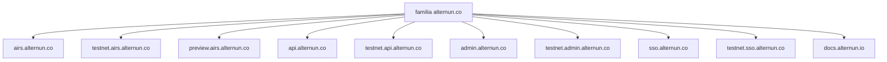
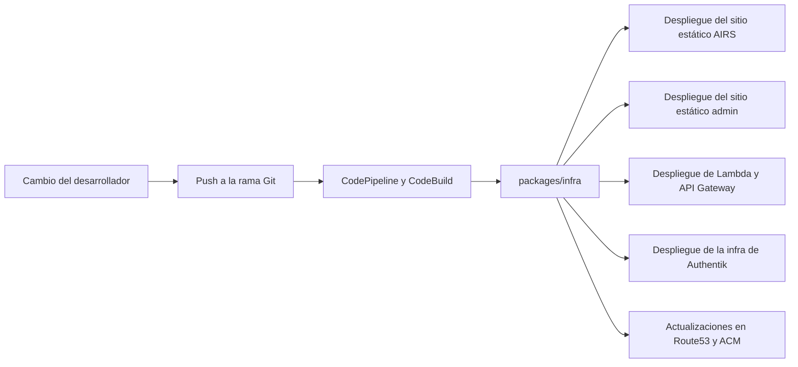

# Infraestructura y Entrega

Alternun aprovisiona infraestructura desde el monorepo mediante `packages/infra`.

El proyecto usa:

- **SST** como wrapper de la app y punto de entrada del despliegue
- **recursos AWS con Pulumi** dentro de los módulos de infraestructura
- **CodeBuild y CodePipeline** para flujos de entrega gestionados
- **Route53 y ACM** para DNS y certificados

## Modelo De Stages

La plataforma está dividida en varias familias de despliegue.

### Stages Públicos de AIRS

- `production`
- `dev`
- `mobile`

Dominios públicos por defecto:

- `airs.alternun.co`
- `testnet.airs.alternun.co`
- `preview.airs.alternun.co`

### Backend y stages internos

- `dashboard-dev`
- `dashboard-prod`
- `api-dev`
- `api-prod`
- `admin-dev`
- `admin-prod`
- `identity-dev`
- `identity-prod`

Estos permiten que el equipo despliegue superficies internas de forma independiente o como una unidad de release combinada.

## Modelo De Dominios

La familia actual de dominios separa las superficies públicas del producto de las superficies de marketing.

Detalle importante:

- el sitio público de marketing/corporativo permanece en `alternun.io`
- las superficies de aplicación e identidad usan la familia de dominios `alternun.co`

## Lo Que Aprovisiona El Paquete De Infra

### Entrega de la app pública

Para AIRS, el paquete de infra aprovisiona:

- entrega de sitio estático para el build web de Expo
- buckets de assets
- ruta de distribución respaldada por CloudFront
- redirecciones según el stage

### Entrega de la API backend

Para la API personalizada, el paquete de infra aprovisiona:

- Lambda
- API Gateway HTTP API
- logs en CloudWatch
- mapeo de dominio personalizado
- ACM y validación DNS cuando hace falta

### Entrega del admin

Para la consola admin, el paquete de infra aprovisiona:

- hosting estático
- distribución CDN
- dominios personalizados y certificados

### Entrega de identity

Para Authentik, el paquete de infra aprovisiona:

- VPC y grupos de seguridad
- host de runtime en EC2
- PostgreSQL en RDS opcional
- payloads en Secrets Manager
- registros en Route53
- rutas TLS basadas en ACME o ACM según el stage

## Modelo De Pipeline

El catálogo de pipelines por defecto incluye:

- `production`
- `dev`
- `identity-dev`
- `identity-prod`
- `dashboard-dev`
- `dashboard-prod`

El mapeo por defecto de ramas en la configuración de infra envía los stacks orientados a dev a `develop` y los orientados a producción a `master`.

## Flujo De Entrega

## Por Qué Existen Stacks Combinados y Dedicados

El sistema de infraestructura soporta ambos:

- **dashboard stacks combinados** para admin y API juntos
- **stacks dedicados como escape hatch** para operaciones manuales de solo API o solo admin

Ese diseño es pragmático:

- mantiene más simples los releases normales
- aún permite rutas de despliegue controladas por componente
- reduce el riesgo de eliminaciones accidentales al incorporar protecciones dentro de la lógica de infra

## Fuente De Verdad Práctica

Si quieres ver las definiciones reales de infraestructura, lee estos archivos en este orden:

1. `packages/infra/infra.config.ts`
2. `packages/infra/config/infrastructure-specs.ts`
3. `packages/infra/modules/*`
4. `packages/infra/INFRASTRUCTURE_SPECS.md`

La documentación pública aquí resume esas fuentes para facilitar la comprensión humana, pero el código sigue siendo la fuente de verdad real.
