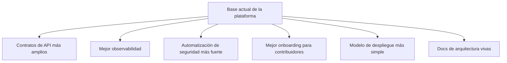

# Próximas Mejoras

Esta página documenta los siguientes pasos más importantes para la plataforma desde un punto de vista de ingeniería.

Es intencionalmente práctica. La meta no es describir un diagrama futuro perfecto, sino identificar las mejoras que reforzarían materialmente la plataforma.

## 1. Expandir La API Personalizada Con Cuidado

La API de NestJS debería seguir creciendo, pero no convirtiéndose en un contenedor improvisado para cualquier lógica.

Siguientes pasos de alto valor:

- agregar más endpoints de dominio con DTOs documentados y auth guards
- ampliar la cobertura de OpenAPI para que el contrato backend sea público y revisable
- agregar pruebas de integración más fuertes para auth, salud y flujos operativos
- restringir CORS a orígenes permitidos explícitos por entorno

## 2. Madurar El Contrato De Runtime De AIRS

La app pública AIRS ya tiene una responsabilidad real de producto. El siguiente paso es hacer más explícito su contrato con backend e identity.

Mejoras sugeridas:

- documentar contratos estables entre cliente y servicio
- aclarar qué responsabilidades viven en Supabase y cuáles en la API personalizada
- estandarizar el manejo de roles y claims en todas las superficies
- documentar con más claridad los límites de confianza y los comportamientos de fallback relacionados con wallet

## 3. Mejorar La Observabilidad De Infraestructura

El paquete de infra ya despliega la plataforma, pero la visibilidad sobre la salud del runtime todavía puede mejorar.

Mejoras sugeridas:

- dashboards por stage para API, identity y entrega estática
- resúmenes de despliegue con enlaces directos a endpoints de salud y docs
- logs estructurados de aplicación y correlación de trazas
- alertas explícitas para fallos clave de identity y API

## 4. Endurecer La Automatización De Seguridad

Los siguientes controles útiles incluirían:

- flujo más estricto de revisión de dependencias
- generación automatizada de SBOM para artefactos de release
- reportes programados de vulnerabilidades, más allá de comandos básicos de auditoría
- verificación más fuerte del manejo de secretos en CI
- un proceso `security.md` público para reportes coordinados

## 5. Reducir La Complejidad Del Despliegue

El modelo actual de stacks es potente, pero algunos comportamientos de alias de stage y límites de ownership todavía son fáciles de malinterpretar.

Buenos siguientes pasos:

- simplificar reglas de nombres de stages cuando sea posible
- hacer más fácil razonar sobre ownership entre stacks combinados y dedicados
- documentar todos los caminos seguros de despliegue en una sola página canónica
- agregar más verificaciones automatizadas para colisiones de alias de stack y solapamiento de rutas

## 6. Mejorar El Onboarding Open Source

Para colaboradores públicos, al repositorio todavía le falta una primera hora más fluida.

Mejoras sugeridas:

- agregar una guía rápida de arquitectura pensada para contribuidores
- publicar una página de "cómo ejecutar las superficies principales localmente"
- documentar las variables de entorno esperadas por app
- mantener un índice de registros de decisiones de arquitectura

## 7. Mantener Las Docs Como Una Superficie De Primera Clase

La documentación debe seguir sincronizada con el código base en vez de convertirse en una capa de explicación desactualizada.

Hábitos recomendados:

- actualizar docs cuando cambie el modelo de despliegue
- actualizar docs cuando cambien los límites de auth
- documentar nuevas APIs públicas como parte de la implementación, no después
- mantener los diagramas Mermaid cerca del runtime actual, no de conjeturas futuras

## Mapa De Mejoras

## Nota Final

Las mejoras más útiles son las que reducen la ambigüedad.

En este repositorio, eso normalmente significa:

- aclarar mejor los límites
- hacer más seguros los despliegues
- hacer más explícitos los contratos
- hacer que la documentación sea más fácil de confiar
