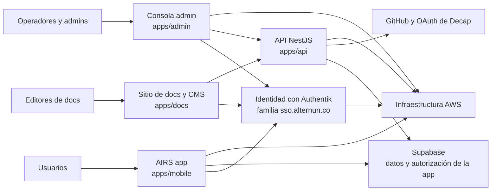

# Arquitectura de Alternun y AIRS

Esta sección es el mapa técnico público de la plataforma Alternun.

Está escrita para:

- usuarios que quieren entender cómo está construido el producto
- nuevos ingenieros que se incorporan al proyecto
- colaboradores externos que leen el monorepo por primera vez
- miembros de la comunidad open source que quieren una descripción clara del sistema antes de entrar en el código

## ¿Qué es Alternun?

Alternun es el paraguas más amplio de producto e infraestructura.

Hoy el repositorio contiene varias superficies conectadas:

- **AIRS**: la experiencia principal de la aplicación pública entregada desde el stack cliente basado en Expo
- **Admin**: la consola operativa interna para flujos gestionados
- **API**: el servicio backend personalizado usado para endpoints operativos y de integración
- **Identity**: la capa de autenticación y OIDC basada en Authentik
- **Docs**: el sitio público de documentación en Docusaurus y el editor CMS protegido
- **Infra**: el código de SST y Pulumi que aprovisiona recursos de AWS y pipelines de despliegue

## ¿Qué es AIRS?

AIRS es la superficie actual de la aplicación orientada al usuario dentro de la familia de dominios `airs.alternun.co`.

En términos prácticos, AIRS es la parte del sistema con la que las personas usuarias interactúan primero:

- experiencia de onboarding y marketing dentro de la app web construida con Expo
- autenticación y manejo de sesiones
- conceptos de dashboard de usuario como saldo AIRS, portafolio y actividad relacionada con impacto
- entrega móvil y web desde una sola base de código compartida

## Vista General Del Sistema

## Principios Arquitectónicos

Actualmente el monorepo sigue algunos principios prácticos:

1. **Un repositorio, múltiples superficies de entrega.** La app pública, el admin, la documentación, la API y la infraestructura viven juntos para coordinar cambios compartidos.
2. **Bloques compartidos antes que lógica duplicada.** La autenticación, i18n, UI y las plantillas de correo se separan en paquetes reutilizables.
3. **Entrega consciente del entorno.** El proyecto publica stacks distintos para producción, dev/testnet, preview/mobile, dashboard e identity.
4. **Infraestructura como código primero.** Los recursos de AWS, dominios, pipelines, redirecciones y valores por defecto de runtime se definen en `packages/infra`.
5. **Modelo backend híbrido.** La plataforma hoy combina servicios gestionados como Supabase con un backend personalizado en NestJS que sigue creciendo.

## Los Tres Planos Principales

### 1. Plano De Producto

Es lo que experimentan los usuarios finales y los miembros de la comunidad:

- app pública AIRS
- puntos de entrada de cuenta y wallet
- dashboard de usuario e interfaces relacionadas con impacto
- contenido multilingüe y puntos de contacto por correo

### 2. Plano De Operaciones

Aquí es donde trabajan los equipos internos:

- consola admin
- flujo de edición de docs
- endpoints operativos del backend
- despliegues impulsados por pipelines

### 3. Plano De Plataforma

Esta es la capa fundacional:

- identity
- DNS
- certificados
- hosting estático
- Lambda y API Gateway
- EC2 y RDS para Authentik
- entrega impulsada por CodeBuild y CodePipeline

## Estado Actual

El repositorio ya está estructurado como una plataforma, pero no todos los subsistemas tienen el mismo nivel de madurez.

Lo que ya está claro y activo:

- entrega de la app pública AIRS
- topología de despliegue gestionada en AWS
- dirección de identidad basada en Authentik
- docs en Docusaurus y flujo de edición con Decap
- stacks de despliegue para admin y API

Lo que sigue creciendo:

- una superficie más amplia para la API personalizada
- observabilidad más profunda
- mayor cobertura automatizada de seguridad y regresiones
- más notas públicas de arquitectura orientadas a desarrolladores

## Lee Esta Sección En Orden

Para un onboarding más claro:

1. Empieza con [Monorepo y Stack](./monorepo-and-stack.md)
2. Sigue con [Arquitectura en tiempo de ejecución](./runtime-architecture.md)
3. Luego lee [Infraestructura y entrega](./infrastructure-and-delivery.md)
4. Termina con [Seguridad y calidad](./security-and-quality.md) y [Próximas mejoras](./next-improvements.md)
