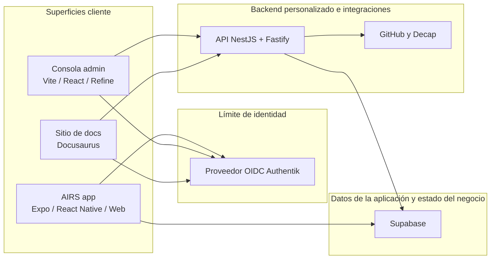
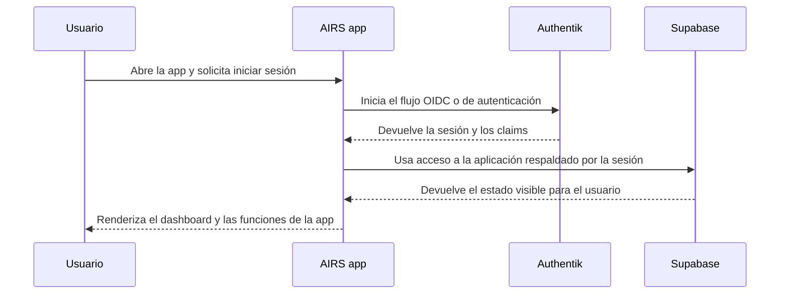
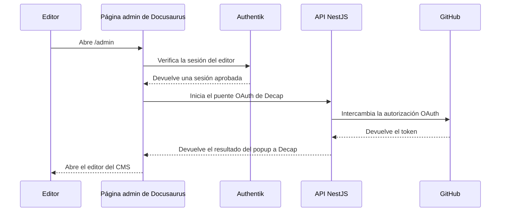

# Arquitectura en Tiempo de Ejecución

El sistema en ejecución es una combinación de aplicaciones cliente, servicios gestionados y servicios personalizados alojados en AWS.

La forma más simple de entenderlo es seguir los límites de confianza.

## Topología De Runtime

## Modelo De Confianza

La dirección actual de identidad del repositorio es esta:

- Authentik es el proveedor de identidad y la fuente de verdad para OIDC
- Supabase sigue siendo la capa de datos y autorización de la aplicación
- las capacidades backend personalizadas viven en la API de NestJS

Esto crea un modelo de runtime híbrido:

- la identidad no pertenece al frontend
- los datos principales del producto no están codificados dentro de la API
- algunos flujos siguen guiados por servicios mientras la API personalizada crece con el tiempo

## Runtime De AIRS

En AIRS, el runtime actual gira alrededor de la app construida con Expo:

- la misma familia de aplicaciones soporta comportamiento móvil nativo y publicación web
- la autenticación se abstrae a través del paquete compartido de auth
- Supabase ya forma parte del modelo de integración del lado cliente
- el comportamiento relacionado con wallets existe dentro del stack de la app pública

En otras palabras, AIRS no es solo un frontend estático de marketing. Es el comienzo del runtime real de la aplicación.

## Runtime Del Admin

La consola admin está separada intencionalmente de la app pública AIRS:

- tiene su propio objetivo de despliegue
- usa flujos OIDC a través de Authentik
- está pensada para uso interno y operativo
- puede publicarse junto con la API personalizada dentro de dashboard stacks combinados

Esa separación reduce el acoplamiento accidental entre los recorridos de usuarios públicos y los flujos internos de operación.

## Runtime De La Documentación

El sistema de docs tiene dos modos:

1. entrega pública de documentación con Docusaurus
2. flujo editorial protegido mediante Decap CMS y gating con Authentik

Eso significa que la documentación se trata como una superficie real de producto, con autenticación, flujo de contenido y dependencias de infraestructura, no solo como una carpeta estática de archivos markdown.

## Flujo De Ejemplo: Inicio De Sesión En AIRS

## Flujo De Ejemplo: Edición De Docs

## Qué Vive Dónde Hoy

### Principalmente impulsado por cliente hoy

- renderizado de la UI de AIRS
- manejo de sesión del lado de la app
- presentación multilingüe
- composición de recorridos e interfaces de usuario

### Principalmente impulsado por servicios hoy

- identity
- aprovisionamiento de infraestructura
- pipelines de despliegue
- publicación de documentación

### Área de backend personalizado que sigue creciendo

- API operativa de NestJS
- documentación OpenAPI
- puntos de integración como endpoints de puente OAuth
- lógica futura de dominio backend que no debería quedarse en los clientes

## Realidad Arquitectónica Importante

Este repositorio todavía no es una arquitectura de "un solo backend lo controla todo".

Es una plataforma en transición:

- algunas capacidades ya están centralizadas
- otras se delegan intencionalmente a servicios gestionados
- otras aún se están moviendo desde patrones del lado cliente hacia servicios backend dedicados

Eso no es un problema por sí mismo, pero es importante que quienes contribuyen lo entiendan antes de proponer refactors grandes.
