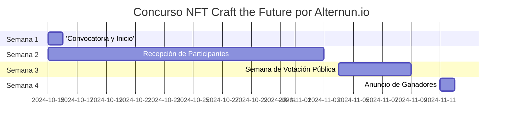

# General

## Objetivo del Concurso
Promover la creación de piezas de arte únicas que expliquen gráficamente la misión y operación de Alternun, generando interés en la tokenización de activos reales.

## Cronograma del Concurso

| Fase                      | Fechas                    |
| -------------------------- | ------------------------ |
| Convocatoria y Inicio     | 15 de octubre            |
| Recepción de Participantes  | 15 de octubre - 3 de noviembre  |
| Semana de Votación Pública | 4 de noviembre - 8 de noviembre |
| Anuncio de Ganadores      | 11 de noviembre          |

[Full Screen](https://www.mermaidchart.com/raw/e4f8f7fb-7732-473a-b72a-2a5ddc6f1acf?theme=light&version=v0.1&format=svg)

## Premios

| Posición                       | Artista Seleccionado                     | Monto(USD) |
| ------------------------------ | ----------------------------------- | ----------- |
| 1er lugar                      | 1 artista seleccionado por la comunidad      | $200        |
| 2do lugar                      | 1 artista seleccionado por la comunidad | $100        |
| 3er lugar                      | 1 artista seleccionado por la comunidad | $50         |
| Criterios para el compromiso social | Top 17 artistas                       | $10 (Cada uno)  |

:::info
Todos los participantes obtendrán experiencia valiosa que se tendrá en cuenta en el Evento de Generación de Tokens de Alternun (TGE Q1 2025) a través de Zealy. \
Todos los premios se distribuirán en la criptomoneda nativa del Blockchain Stellar USD equivalente. \
[Información sobre Stellar](https://stellarchain.io/)
:::
# Guía de Registro

## Criterios de Elegibilidad
- Los participantes deben tener al menos 18 años.
- Los participantes deben tener una cuenta válida de Zealy.
- Todas las presentaciones deben ser obras de arte originales creadas por el participante.
- Los participantes deben completar el formulario de registro para ser elegibles para la selección.

## Proceso de Registro Paso a Paso
:::tip
Asegúrate de iniciar sesión en Zealy antes de enviar el formulario para evitar la eliminación de datos al iniciar sesión.
:::

1. **Completa el Formulario en Zealy**
   - Visita la plataforma Zealy.
   - Completa el formulario proporcionando tu **nombre** y **dirección de correo electrónico**.
   - Para información adicional, puedes usar este [enlace de invitación a Zealy](https://zealy.io/cw/alternun/invite/TTVWe--hMN2Y3N-ibl-XV).
   

  
Formulario de Registro

  https://zealy.io/cw/alternun/questboard/c7da4780-1ad0-4ad8-8cb8-affbcff91ab2/1a7427e2-4ac4-4d0f-abb2-23ad8e19e456

1. **Recibe la Guía en tu Correo**
   - Después de enviar el formulario, revisa tu correo electrónico.
   - Recibirás un correo electrónico con instrucciones sobre cómo montar el enlace a tu NFT en la galería y en tu blockchain preferida.

2. **Monta tu NFT**
   - Sigue las instrucciones proporcionadas en el correo electrónico para subir tu obra de arte a la galería y vincularla a la blockchain de tu elección.

3. **Campaña de Selección de Artistas**
   - Participa en la campaña de Zealy, donde los **top 17 artistas** serán seleccionados a través de votación pública.
   - El proceso de selección de la comunidad implica completar las tareas de Zealy que fomentan el compromiso social en las redes sociales. Los participantes pueden ganar puntos al compartir su obra de arte y interactuar con la comunidad en varias plataformas.
   - Además, los artistas se animan a aprender de la documentación de Alternun y completar las pruebas de proceso para entender mejor el proyecto y mejorar sus presentaciones.

## Guía de Estilo de Arte
- No hay restricciones en el tipo de arte que puedes presentar; puedes utilizar video, GIF o imágenes.
- Sin embargo, por favor, no incluyas ningún isotipo o logotipo de Alternun en tu obra de arte.
- Todas las obras de arte presentadas deben estar publicadas en una galería, como OpenSea o otra galería de blockchain.

:::warning
- Todas las presentaciones deben no contener contenido racista, violento o explícitamente sexual. Animamos la creatividad mientras nos aseguramos de un ambiente respetuoso e inclusivo para todos los participantes.
:::

## ¡Buena Suerte!

Esperamos ver tu arte en el concurso y cómo contribuyes a redefinir el futuro de la minería digital y los proyectos DeFi a través de la arte de NFT.

### Semana de Votación Pública (4 de noviembre - 1 de noviembre)
- **Proceso de Votación**:
  - Publica las obras de arte top3 en una galería virtual en el sitio web de Alternun.
  - sistema de votación a través de la Alternun DAO
  
- **Promoción de la Votación**:
  - Publicaciones diarias en Instagram y Twitter para recordar a la comunidad que vote.
  - Crea una campaña de hashtag para fomentar la participación.

### Anuncio de Ganadores

11 de noviembre A través de Alternun X
