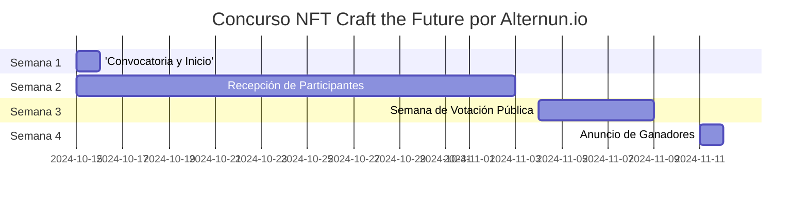

# General

## Objetivo del Concurso
Promover la creación de piezas de arte únicas que expliquen gráficamente la misión y operación de Alternun, generando interés en la tokenización de activos reales.

## Cronograma del Concurso

| Fase                       | Fechas                          |
| -------------------------- | ------------------------------- |
| Convocatoria y Inicio      | 15 de octubre                   |
| Recepción de Participantes | 15 de octubre - 3 de noviembre  |
| Semana de Votación Pública | 4 de noviembre - 8 de noviembre |
| Anuncio de Ganadores       | 11 de noviembre                 |

## Premios

| Posición                            | Artista Seleccionado                    | Monto(USD)     |
| ----------------------------------- | --------------------------------------- | -------------- |
| 1er lugar                           | 1 artista seleccionado por la comunidad | $200           |
| 2do lugar                           | 1 artista seleccionado por la comunidad | $100           |
| 3er lugar                           | 1 artista seleccionado por la comunidad | $50            |
| Criterios para el compromiso social | Top 17 artistas                         | $10 (Cada uno) |

:::info
Todos los participantes obtendrán experiencia valiosa que se tendrá en cuenta en el Evento de Generación de Tokens de Alternun (TGE Q1 2025) a través de Zealy. \
Todos los premios se distribuirán en la criptomoneda nativa del blockchain Stellar, equivalente en USD. \
[Información de Stellar](https://stellarchain.io/)
:::
# Guía de Registro

## Criterios de Elegibilidad
- Los participantes deben tener al menos 18 años.
- Los participantes deben tener una cuenta válida de Zealy.
- Todas las presentaciones deben ser obras de arte originales creadas por el participante.
- Los participantes deben completar el formulario de registro para ser elegibles para la selección.

## Proceso de Registro Paso a Paso
:::tip
Asegúrate de iniciar sesión en Zealy antes de enviar el formulario para evitar la eliminación de datos al iniciar sesión.
:::

1. **Completa el Formulario de Registro**
   - Únete a nuestra comunidad en [Zealy 🔗](https://zealy.io/cw/alternun/invite/TTVWe--hMN2Y3N-ibl-XV).
   - Completa la misión de X (seguir en Twitter) en el módulo de soporte social. [🔗](https://zealy.io/cw/alternun/questboard/08729b66-f66a-4364-8691-6fbcffff4f0a/469c1245-ab3b-406c-8e9d-5c8e8c82a9cc)
   - Encuentra el módulo Craft the Future. [🔗](https://zealy.io/cw/alternun/questboard/c7da4780-1ad0-4ad8-8cb8-affbcff91ab2)
   - Completa el formulario de registro de artistas. [🔗](https://zealy.io/cw/alternun/questboard/c7da4780-1ad0-4ad8-8cb8-affbcff91ab2/1a7427e2-4ac4-4d0f-abb2-23ad8e19e456)
   - **Simplified Registration**: You can also register by providing your email at [this link](https://xozsu5eiys2.typeform.com/to/MuDsJSqh). Please note that to submit your artwork, you must also follow us on Twitter and Discord via Zealy.

2. **Recibe la Guía en tu Correo Electrónico**
   - Después de enviar el formulario, revisa tu correo electrónico.
   - Recibirás un correo con instrucciones sobre cómo montar el enlace a tu NFT en la galería y en tu blockchain preferido.

3. **Monta tu NFT**
   - Sigue las instrucciones proporcionadas en el correo para subir tu obra de arte a la galería y vincularla a la blockchain de tu elección.

4. **Campaña de Selección de Artistas**
   - Participa en la campaña de Zealy, donde los **17 mejores artistas** serán seleccionados a través de votación pública.
   - El proceso de selección de la comunidad implica completar misiones de Zealy que fomentan el compromiso en redes sociales. Los participantes pueden ganar puntos compartiendo su obra de arte y participando con la comunidad en varias plataformas.
   - Además, se anima a los artistas a aprender de la documentación de Alternun y completar cuestionarios de procesos para comprender mejor el proyecto y mejorar sus presentaciones.

## Guía de Estilo Artístico y Requisitos de Presentación
- No hay restricciones sobre el tipo de arte que puedes presentar; puedes usar video, GIF o imágenes.
- Sin embargo, no incluyas isótopos o logotipos de Alternun en tu obra de arte.
- Todas las obras de arte presentadas deben publicarse en una galería, como OpenSea u otra galería de blockchain.
- Se permite el uso de herramientas de IA para generar arte, pero asegúrate de infundir tu alma en el proceso.
- El formato de presentación debe ser 1:1 con una resolución mínima de 2400px.
- Debes presentar un mínimo de una pieza gráfica y un máximo de 3 como una serie de NFT.
- Para inspiración, visita la página de aterrizaje del concurso en [https://craft-the-future.alternun.io/es](https://craft-the-future.alternun.io).

:::warning
- Todas las presentaciones no deben contener contenido racista, violento o sexualmente explícito. Fomentamos la creatividad mientras aseguramos un entorno respetuoso e inclusivo para todos los participantes.
:::

## Propiedad Intelectual y Derechos
- Los derechos intelectuales y comerciales del NFT son propiedad del artista. 
- El artista otorga a Alternun la autorización para usar la obra en las propias publicaciones de Alternun y en nuestros sitios, siempre reconociendo al autor.

## Recomendación de Billetera
Para recibir premios en la blockchain Stellar, recomendamos instalar la billetera LOBSTR:

[Billetera LOBSTR en Google Play](https://play.google.com/store/apps/details?id=com.lobstr.client&hl=es_VE&pli=1)

LOBSTR es una billetera fácil de usar y segura para gestionar tus activos Stellar, incluyendo XLM. Ofrece características como:
- Interfaz simple e intuitiva
- Google 2FA
- Soporte para activos Stellar
- Seguridad con PIN y huella digital
- Gráficos en vivo
- Soporte para códigos QR
- Notificaciones push para transacciones
- Almacenamiento seguro de datos

## ¡Buena Suerte!

Esperamos ver tu arte en el concurso y cómo contribuyes a redefinir el futuro de la minería digital y los proyectos DeFi a través del arte NFT.

### Semana de Votación Pública (4 de noviembre - 8 de noviembre)
- **Proceso de Votación**:
  - Publicar las 3 mejores obras recibidas en una galería virtual en el sitio web de Alternun.
  - sistema de votación a través de Alternun DAO
  
- **Promoción de la Votación**:
  - Publicaciones diarias en Instagram y Twitter para recordar a la comunidad que vote.
  - Crear una campaña de hashtag para fomentar la participación.

### Anuncio de Ganadores

11 de noviembre a través de Alternun X
