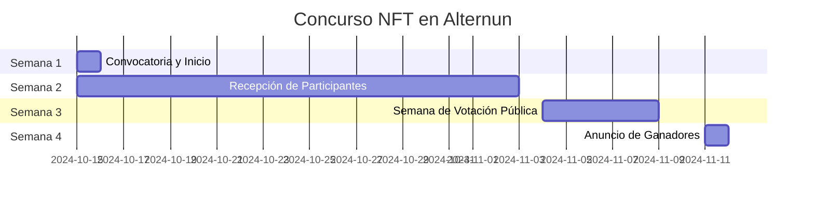

# General

## Objetivo del Concurso
Promover la creación de piezas de arte únicas que expliquen gráficamente la misión y operación de Alternun, generando interés en la tokenización de activos reales.

## Cronograma del Concurso

| Fase                       | Fechas                          |
| -------------------------- | ------------------------------- |
| Convocatoria y Inicio      | 15 de octubre                   |
| Recepción de Participantes | 15 de octubre - 3 de noviembre  |
| Semana de Votación Pública | 4 de noviembre - 8 de noviembre |
| Anuncio de Ganadores       | 11 de noviembre                 |

## Premios

| Posición                            | Artista Seleccionado por la Comunidad     | Monto           |
| ----------------------------------- | ----------------------------------------- | --------------- |
| 1er lugar                           | 1 artista seleccionado por la comunidad   | $300            |
| 2do lugar                           | 2 artistas seleccionados por la comunidad | $200 (cada uno) |
| 3er lugar                           | 3 artistas seleccionados por la comunidad | $100 (cada uno) |
| Criterios para el compromiso social | 20 mejores participantes                  | $10 cada uno    |

*Todos los participantes obtendrán experiencia valiosa que se tendrá en cuenta en el TGE.

## Plan Detallado

### 1. Preparación (Antes del 15 de octubre)
- **Definir el mensaje clave**: Desarrollar una descripción clara de la misión y operación de Alternun que los artistas deben reflejar en sus obras.
- **Crear un breve**: Incluir requisitos de diseño, tamaño de NFT, formato y temas a abordar.
- **Diseñar gráficos promocionales**: Crear gráficos promocionales para redes sociales.

### 2. Lanzamiento de la Convocatoria (15 de octubre)
- **Instagram**:
  - Publicar una publicación atractiva con gráficos.
  - Historias interactivas (encuestas sobre lo que piensan los seguidores sobre la tokenización de activos).
  - Usar hashtags relevantes (#NFTArt, #TokenizationOfAssets, #AlternunArt).
  
- **Twitter**:
  - Tweet inicial con un hilo explicando el concurso.
  - Compartir la publicación de Instagram y un enlace al sitio de Alternun.
  - Tweet diario con recordatorios y consejos para participar.
  
- **LinkedIn**:
  - Publicación detallada sobre la misión de Alternun y cómo el arte puede ayudar a comunicarla.
  - Invitar a la comunidad a participar y compartir sus obras.

### 3. Recepción de Participantes (15 de octubre - 25 de octubre)
- **Canales de Recepción**:
  - Crear un formulario de Google para que los artistas envíen sus obras.
  - Indicar que las obras deben ser enviadas como enlaces a NFTs o archivos digitales.
  
- **Promoción Continua**:
  - Recordatorios semanales en redes sociales.
  - Historias y tweets mostrando obras destacadas (si es posible).

### 4. Semana de Votación Pública (28 de octubre - 1 de noviembre)
- **Votación**:
  - Publicar las obras recibidas en una galería virtual en el sitio web de Alternun.
  - Crear un sistema de votación (formularios de Google o herramientas de votación en línea).
  
- **Promoción de la Votación**:
  - Publicaciones diarias en Instagram y Twitter para recordar a la comunidad que vote.
  - Crear una campaña de hashtag para fomentar la participación.

### 5. Anuncio de Ganadores

## Consideraciones Adicionales
- **Colaboraciones**: Considerar colaborar con influencers del mundo del arte y NFT para mayor visibilidad.
- **Comunicaciones**: Mantener una comunicación constante con los participantes durante todo el proceso.
- **Feedback**: Pedir feedback de los participantes y votantes después del concurso para mejorar futuras ediciones.
