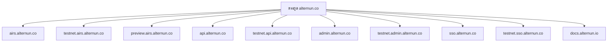
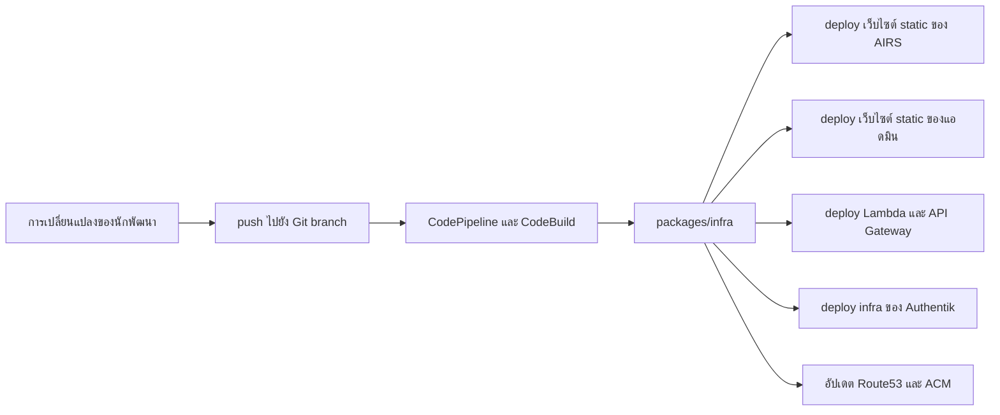

# โครงสร้างพื้นฐานและการส่งมอบ

Alternun provision โครงสร้างพื้นฐานจาก monorepo ผ่าน `packages/infra`

โครงการนี้ใช้:

- **SST** เป็น app wrapper และจุดเริ่มต้นของการ deploy
- **Pulumi AWS resources** ภายในโมดูล infra
- **CodeBuild และ CodePipeline** สำหรับ flow การส่งมอบแบบมีการจัดการ
- **Route53 และ ACM** สำหรับ DNS และใบรับรอง

## โมเดลของ Stage

แพลตฟอร์มถูกแบ่งออกเป็นหลายตระกูลการปรับใช้

### Stage สาธารณะของ AIRS

- `production`
- `dev`
- `mobile`

โดเมนสาธารณะเริ่มต้น:

- `airs.alternun.co`
- `testnet.airs.alternun.co`
- `preview.airs.alternun.co`

### Backend และ stage ภายใน

- `dashboard-dev`
- `dashboard-prod`
- `api-dev`
- `api-prod`
- `admin-dev`
- `admin-prod`
- `identity-dev`
- `identity-prod`

สิ่งเหล่านี้ทำให้ทีม deploy พื้นผิวภายในได้อย่างอิสระ หรือปล่อยเป็นหน่วยรีลีสเดียวกันก็ได้

## โมเดลของโดเมน

ตระกูลโดเมนปัจจุบันแยกพื้นผิวผลิตภัณฑ์สาธารณะออกจากพื้นผิวการตลาด

รายละเอียดที่ควรรู้:

- เว็บไซต์สาธารณะด้านการตลาด/องค์กรยังคงอยู่บน `alternun.io`
- พื้นผิวแอปและ identity ใช้ตระกูลโดเมน `alternun.co`

## แพ็กเกจ Infra Provision อะไรบ้าง

### การส่งมอบแอปสาธารณะ

สำหรับ AIRS แพ็กเกจ infra จะ provision:

- การส่งมอบเว็บไซต์แบบ static สำหรับ Expo web build
- bucket สำหรับ asset
- เส้นทางการกระจายที่รองรับด้วย CloudFront
- redirect ตาม stage

### การส่งมอบ Backend API

สำหรับ API แบบกำหนดเอง แพ็กเกจ infra จะ provision:

- Lambda
- API Gateway HTTP API
- logging ใน CloudWatch
- การแมป custom domain
- ACM และการตรวจสอบ DNS เมื่อจำเป็น

### การส่งมอบแอดมิน

สำหรับคอนโซลแอดมิน แพ็กเกจ infra จะ provision:

- static site hosting
- CDN distribution
- custom domain และใบรับรอง

### การส่งมอบ identity

สำหรับ Authentik แพ็กเกจ infra จะ provision:

- VPC และ security group
- โฮสต์รันไทม์บน EC2
- RDS PostgreSQL แบบ optional
- payload ใน Secrets Manager
- record ใน Route53
- เส้นทาง TLS แบบ ACME หรือ ACM ตาม stage

## โมเดลของ Pipeline

แคตตาล็อก pipeline เริ่มต้นประกอบด้วย:

- `production`
- `dev`
- `identity-dev`
- `identity-prod`
- `dashboard-dev`
- `dashboard-prod`

การจับคู่ branch เริ่มต้นใน config infra จะส่ง stack ฝั่ง dev ไปที่ `develop` และ stack ฝั่ง production ไปที่ `master`

## Flow การส่งมอบ

## ทำไมจึงมีทั้งสแตกแบบรวมและแบบเฉพาะ

ระบบ infra รองรับทั้ง:

- **dashboard stack แบบรวม** สำหรับ admin และ API ไปด้วยกัน
- **stack แบบเฉพาะเป็นทางออกเฉพาะกิจ** สำหรับงาน manual ที่เป็น API-only หรือ admin-only

แนวทางนี้ใช้งานได้จริง:

- ทำให้การรีลีสตามปกติง่ายขึ้น
- ยังเปิดทางให้มีเส้นทาง deploy รายองค์ประกอบแบบควบคุมได้
- ลดความเสี่ยงจากการลบโดยไม่ตั้งใจด้วยการใส่กลไกป้องกันไว้ในตรรกะของ infra

## แหล่งความจริงเชิงปฏิบัติ

ถ้าต้องการดูนิยาม infra ที่ใช้งานจริง ให้อ่านไฟล์เหล่านี้ตามลำดับ:

1. `packages/infra/infra.config.ts`
2. `packages/infra/config/infrastructure-specs.ts`
3. `packages/infra/modules/*`
4. `packages/infra/INFRASTRUCTURE_SPECS.md`

เอกสารสาธารณะในส่วนนี้เป็นเพียงการสรุปเพื่อให้มนุษย์อ่านเข้าใจง่ายขึ้น แต่โค้ดยังคงเป็นแหล่งความจริงจริง ๆ
