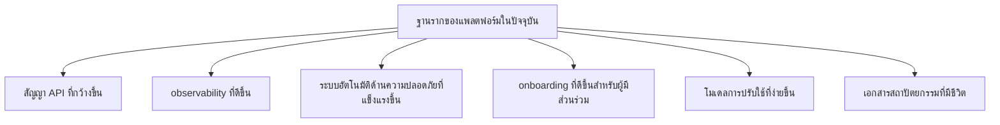

# การปรับปรุงถัดไป

หน้านี้บันทึกก้าวต่อไปที่สำคัญที่สุดของแพลตฟอร์มจากมุมมองทางวิศวกรรม

เนื้อหานี้ตั้งใจให้ใช้ได้จริง เป้าหมายไม่ใช่การวาดภาพอนาคตที่สมบูรณ์แบบ แต่คือการระบุการปรับปรุงที่ช่วยเสริมความแข็งแรงของแพลตฟอร์มอย่างมีนัยสำคัญ

## 1. ขยาย API แบบกำหนดเองอย่างระมัดระวัง

NestJS API ควรเติบโตต่อ แต่ไม่ควรกลายเป็นที่ทิ้งตรรกะแบบเร่งรีบ

ก้าวถัดไปที่มีมูลค่าสูง:

- เพิ่ม domain endpoint พร้อม DTO ที่มีเอกสารและ auth guard
- ขยายความครอบคลุมของ OpenAPI เพื่อให้สัญญาแบ็กเอนด์เปิดเผยและตรวจทานได้
- เพิ่ม integration test ที่แข็งแรงขึ้นสำหรับ auth สุขภาพระบบ และ flow เชิงปฏิบัติการ
- จำกัด CORS ให้เหลือ origin ที่อนุญาตอย่างชัดเจนตามสภาพแวดล้อม

## 2. ทำให้สัญญารันไทม์ของ AIRS เติบโตขึ้น

แอปสาธารณะ AIRS รับผิดชอบต่อผลิตภัณฑ์จริงอยู่แล้ว ขั้นต่อไปคือทำให้สัญญาระหว่างมันกับ backend และ identity ชัดเจนขึ้น

ข้อเสนอการปรับปรุง:

- บันทึกสัญญาที่เสถียรระหว่างไคลเอนต์กับบริการ
- แยกให้ชัดว่าเรื่องใดอยู่ใน Supabase และเรื่องใดอยู่ใน API แบบกำหนดเอง
- ทำให้การจัดการ role และ claim มีมาตรฐานเดียวกันในทุกพื้นผิว
- อธิบายขอบเขตความไว้วางใจและพฤติกรรม fallback ที่เกี่ยวกับ wallet ให้ชัดขึ้น

## 3. ปรับปรุง Observability ของโครงสร้างพื้นฐาน

แพ็กเกจ infra ปรับใช้แพลตฟอร์มได้แล้ว แต่การมองเห็นสุขภาพของรันไทม์ยังดีขึ้นได้อีกมาก

ข้อเสนอการปรับปรุง:

- dashboard ตาม stage สำหรับ API, identity และการส่งมอบแบบ static
- สรุปการ deploy พร้อมลิงก์ตรงไปยัง health endpoint และ docs endpoint
- application log แบบมีโครงสร้างและการเชื่อมโยง trace
- การแจ้งเตือนแบบชัดเจนสำหรับความล้มเหลวสำคัญของ identity และ API

## 4. ทำให้ระบบอัตโนมัติด้านความปลอดภัยแข็งแรงขึ้น

ตัวควบคุมที่มีประโยชน์ต่อไป ได้แก่:

- เวิร์กโฟลว์รีวิว dependency ที่เข้มงวดยิ่งขึ้น
- การสร้าง SBOM อัตโนมัติสำหรับรีลีสอาร์ติแฟกต์
- รายงานช่องโหว่ตามกำหนดเวลา นอกเหนือจากคำสั่ง audit พื้นฐาน
- การตรวจสอบการจัดการ secret ใน CI ที่แข็งแรงขึ้น
- กระบวนการ `security.md` แบบสาธารณะสำหรับการรายงานร่วมกันอย่างมีแบบแผน

## 5. ลดความซับซ้อนของการปรับใช้

โมเดล stack ปัจจุบันทรงพลัง แต่พฤติกรรม alias ของ stage และขอบเขต ownership บางจุดยังทำให้เข้าใจผิดได้ง่าย

ก้าวถัดไปที่ดี:

- ทำให้กฎการตั้งชื่อ stage ง่ายขึ้นเมื่อทำได้
- ทำให้ ownership ระหว่าง stack แบบรวมกับแบบเฉพาะเข้าใจง่ายขึ้น
- รวบรวมเส้นทาง deploy ที่ปลอดภัยทั้งหมดไว้ในหน้ามาตรฐานหน้าเดียว
- เพิ่มการตรวจสอบอัตโนมัติสำหรับการชนกันของ stack alias และการทับซ้อนของ route

## 6. ปรับปรุง Onboarding สำหรับโอเพนซอร์ส

สำหรับผู้มีส่วนร่วมสาธารณะ รีโพนี้ยังต้องการประสบการณ์ชั่วโมงแรกที่ลื่นไหลกว่านี้

ข้อเสนอการปรับปรุง:

- เพิ่ม quickstart ด้านสถาปัตยกรรมที่เขียนเพื่อผู้ร่วมพัฒนา
- เผยแพร่หน้า "วิธีรันพื้นผิวหลักในเครื่อง"
- บันทึก environment variable ที่แต่ละแอปคาดหวังไว้
- ดูแลดัชนีของ architecture decision record ให้ครบถ้วน

## 7. ทำให้เอกสารเป็นพื้นผิวระดับ First-Class ต่อไป

เอกสารควรเดินไปพร้อมกับโค้ดเบส แทนที่จะกลายเป็นชั้นคำอธิบายที่ล้าสมัย

นิสัยที่แนะนำ:

- อัปเดต docs เมื่อโมเดลการ deploy เปลี่ยน
- อัปเดต docs เมื่อขอบเขต auth เปลี่ยน
- บันทึก API สาธารณะใหม่เป็นส่วนหนึ่งของ implementation ไม่ใช่ค่อยมาทำทีหลัง
- ทำให้ Mermaid diagram สะท้อน runtime ปัจจุบัน ไม่ใช่ภาพเดาในอนาคต

## แผนที่ของการปรับปรุง

## หมายเหตุสุดท้าย

การปรับปรุงที่มีประโยชน์ที่สุดคือการลดความกำกวม

ในรีโพนี้ สิ่งนั้นมักหมายถึง:

- ทำให้ขอบเขตชัดเจนขึ้น
- ทำให้การ deploy ปลอดภัยขึ้น
- ทำให้สัญญาต่าง ๆ ชัดเจนขึ้น
- ทำให้เอกสารน่าเชื่อถือได้ง่ายขึ้น
