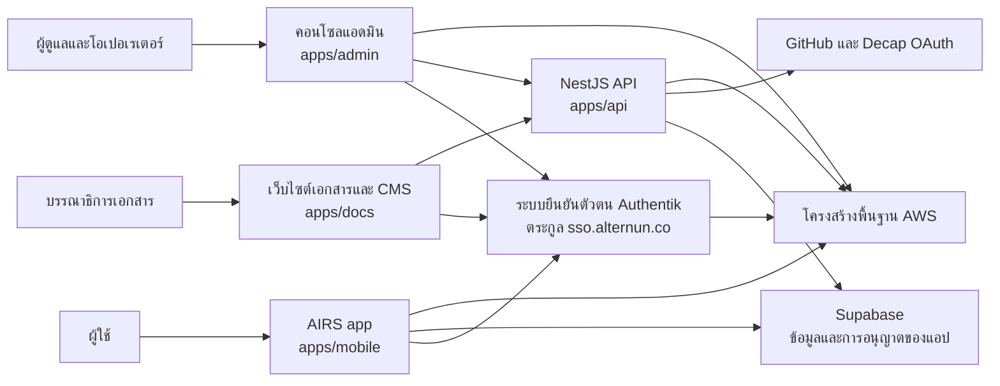

# สถาปัตยกรรมของ Alternun และ AIRS

ส่วนนี้คือแผนที่ทางเทคนิคสาธารณะของแพลตฟอร์ม Alternun

เนื้อหานี้เขียนไว้สำหรับ:

- ผู้ใช้ที่ต้องการเข้าใจว่าผลิตภัณฑ์ประกอบขึ้นอย่างไร
- วิศวกรใหม่ที่เข้าร่วมโครงการ
- ผู้มีส่วนร่วมภายนอกที่อ่าน monorepo นี้เป็นครั้งแรก
- สมาชิกชุมชนโอเพนซอร์สที่ต้องการคำอธิบายระบบที่ชัดเจนก่อนลงลึกไปที่โค้ด

## Alternun คืออะไร?

Alternun คือร่มใหญ่ของผลิตภัณฑ์และโครงสร้างพื้นฐาน

ปัจจุบันรีโพนี้มีพื้นผิวระบบที่เชื่อมต่อกันหลายส่วน:

- **AIRS**: ประสบการณ์แอปสาธารณะหลักที่ส่งมอบจากสแตกไคลเอนต์ที่สร้างด้วย Expo
- **Admin**: คอนโซลปฏิบัติการภายในสำหรับเวิร์กโฟลว์ที่มีการจัดการ
- **API**: บริการแบ็กเอนด์แบบกำหนดเองที่ใช้สำหรับเอ็นด์พอยต์ด้านปฏิบัติการและการเชื่อมต่อ
- **Identity**: ชั้นการยืนยันตัวตนและ OIDC ที่ใช้ Authentik
- **Docs**: เว็บไซต์เอกสารสาธารณะด้วย Docusaurus และตัวแก้ไข CMS ที่มีการป้องกัน
- **Infra**: โค้ด SST และ Pulumi ที่ใช้ provision ทรัพยากร AWS และ deployment pipeline

## AIRS คืออะไร?

AIRS คือพื้นผิวแอปพลิเคชันที่ผู้ใช้ใช้งานอยู่ในปัจจุบันภายใต้ตระกูลโดเมน `airs.alternun.co`

ในทางปฏิบัติ AIRS คือส่วนของระบบที่ผู้ใช้ปลายทางได้สัมผัสก่อน:

- ประสบการณ์ onboarding และแนวทางคล้ายการตลาดภายใน Expo web app
- การยืนยันตัวตนและการจัดการเซสชัน
- แนวคิดแดชบอร์ดของผู้ใช้ เช่น ยอดคงเหลือ AIRS พอร์ตโฟลิโอ และกิจกรรมด้านผลกระทบ
- การส่งมอบทั้งบนมือถือและเว็บจากโค้ดเบสเดียวกัน

## ภาพรวมของระบบ

## หลักการทางสถาปัตยกรรม

ปัจจุบัน monorepo นี้ยึดหลักเชิงปฏิบัติไม่กี่ข้อ:

1. **หนึ่งรีโพ หลายพื้นผิวการส่งมอบ** แอปสาธารณะ แอดมิน เอกสาร API และโครงสร้างพื้นฐานอยู่ร่วมกันเพื่อประสานการเปลี่ยนแปลงที่ใช้ร่วมกัน
2. **ใช้ส่วนประกอบร่วมก่อนคัดลอกตรรกะซ้ำ** การยืนยันตัวตน i18n UI และเทมเพลตอีเมลถูกแยกออกเป็นแพ็กเกจที่นำกลับมาใช้ซ้ำได้
3. **การส่งมอบที่รับรู้สภาพแวดล้อม** โครงการนี้มีสแตกแยกกันสำหรับ production, dev/testnet, preview/mobile, dashboard และ identity
4. **ให้โครงสร้างพื้นฐานเป็นโค้ดมาก่อน** ทรัพยากร AWS โดเมน pipeline การ redirect และค่า runtime เริ่มต้นถูกกำหนดไว้ใน `packages/infra`
5. **โมเดลแบ็กเอนด์แบบไฮบริด** แพลตฟอร์มนี้ผสมผสานบริการที่มีการจัดการอย่าง Supabase เข้ากับแบ็กเอนด์ NestJS แบบกำหนดเองที่กำลังเติบโต

## สามระนาบหลัก

### 1. ระนาบผลิตภัณฑ์

นี่คือสิ่งที่ผู้ใช้ปลายทางและสมาชิกชุมชนได้ใช้งาน:

- แอปสาธารณะ AIRS
- จุดเข้าใช้งานบัญชีและวอลเล็ท
- แดชบอร์ดผู้ใช้และอินเทอร์เฟซที่เกี่ยวข้องกับผลกระทบ
- เนื้อหาหลายภาษาและจุดติดต่อผ่านอีเมล

### 2. ระนาบปฏิบัติการ

นี่คือพื้นที่ทำงานของทีมภายใน:

- คอนโซลแอดมิน
- เวิร์กโฟลว์การแก้ไขเอกสาร
- เอ็นด์พอยต์ปฏิบัติการของแบ็กเอนด์
- การปรับใช้ที่ขับเคลื่อนด้วย pipeline

### 3. ระนาบแพลตฟอร์ม

นี่คือชั้นฐานราก:

- identity
- DNS
- ใบรับรอง
- static hosting
- Lambda และ API Gateway
- EC2 และ RDS สำหรับ Authentik
- การส่งมอบที่ขับเคลื่อนด้วย CodeBuild และ CodePipeline

## สถานะปัจจุบัน

รีโพนี้มีโครงสร้างแบบแพลตฟอร์มแล้ว แต่ไม่ใช่ทุก subsystem ที่มีความพร้อมเท่ากัน

สิ่งที่ชัดเจนและทำงานอยู่แล้ว:

- การส่งมอบแอปสาธารณะ AIRS
- โทโพโลยีการปรับใช้ที่จัดการด้วย AWS
- ทิศทางด้าน identity ที่อิงกับ Authentik
- เอกสาร Docusaurus และเวิร์กโฟลว์แก้ไขด้วย Decap
- สแตกการปรับใช้สำหรับ admin และ API

สิ่งที่ยังเติบโตต่อ:

- พื้นผิวของ API แบบกำหนดเองที่กว้างขึ้น
- observability ที่ลึกขึ้น
- ความครอบคลุมด้านความปลอดภัยและ regression ที่เป็นอัตโนมัติมากขึ้น
- เอกสารสถาปัตยกรรมสาธารณะที่มุ่งไปยังนักพัฒนามากขึ้น

## อ่านส่วนนี้ตามลำดับ

เพื่อให้ onboarding ชัดเจนที่สุด:

1. เริ่มจาก [Monorepo และสแตก](./monorepo-and-stack.md)
2. ต่อด้วย [สถาปัตยกรรมรันไทม์](./runtime-architecture.md)
3. จากนั้นอ่าน [โครงสร้างพื้นฐานและการส่งมอบ](./infrastructure-and-delivery.md)
4. ปิดท้ายด้วย [ความปลอดภัยและคุณภาพ](./security-and-quality.md) และ [การปรับปรุงถัดไป](./next-improvements.md)
