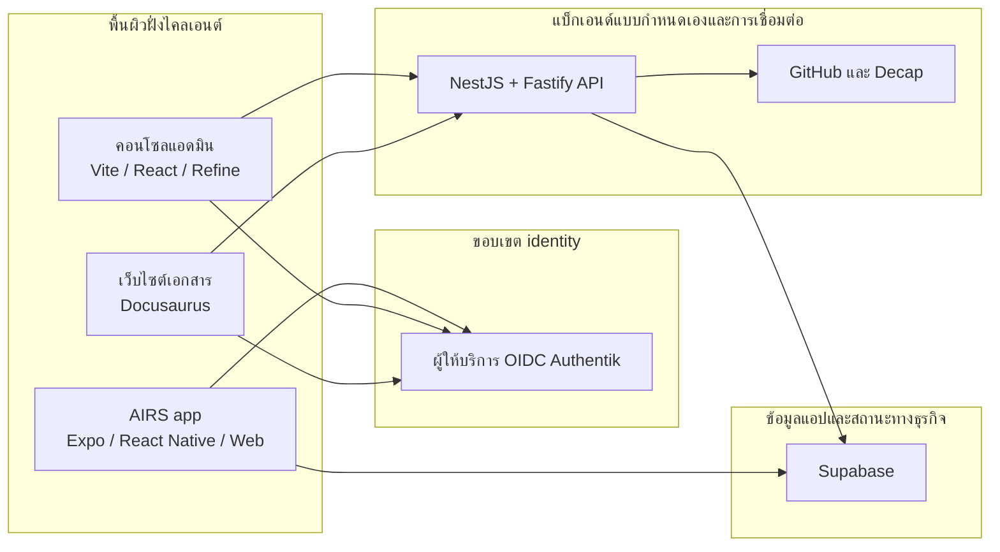
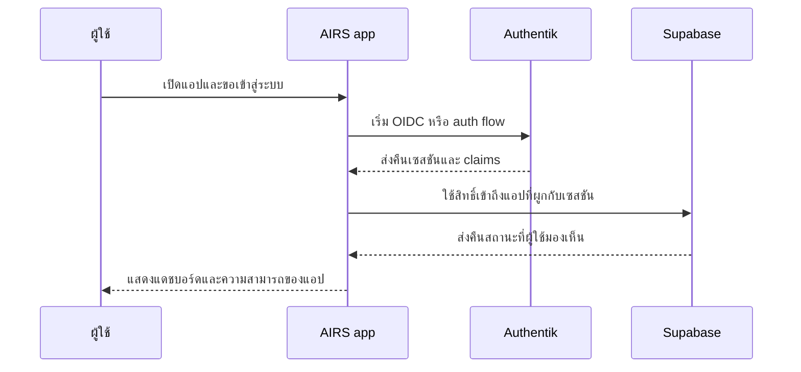
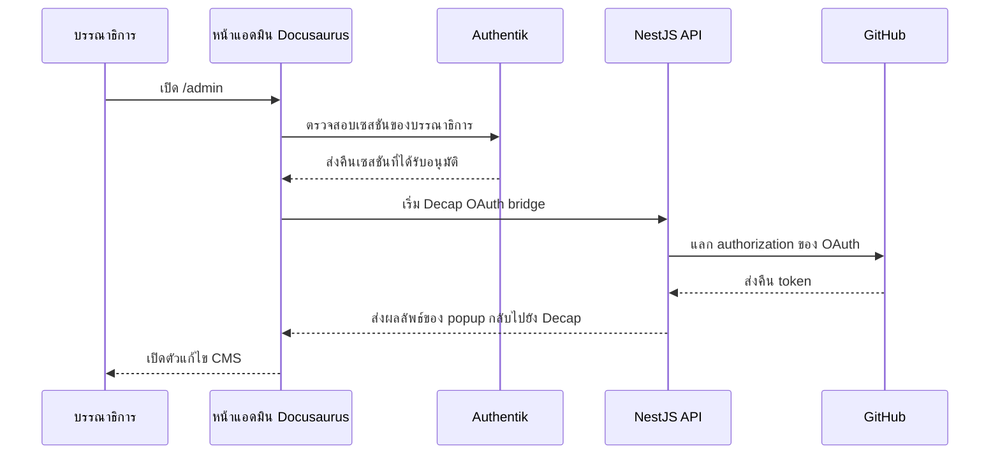

# สถาปัตยกรรมรันไทม์

ระบบที่ทำงานอยู่จริงเป็นการผสมกันของแอปไคลเอนต์ บริการที่มีการจัดการ และบริการแบบกำหนดเองที่โฮสต์บน AWS

วิธีที่ง่ายที่สุดในการทำความเข้าใจคือไล่ตามขอบเขตความไว้วางใจ

## โทโพโลยีรันไทม์

## โมเดลความไว้วางใจ

ทิศทางด้าน identity ของรีโพตอนนี้คือ:

- Authentik เป็นผู้ให้บริการ identity และแหล่งความจริงของ OIDC
- Supabase ยังคงเป็นชั้นข้อมูลแอปและการอนุญาต
- ความสามารถของแบ็กเอนด์แบบกำหนดเองอยู่ใน NestJS API

สิ่งนี้สร้างโมเดลรันไทม์แบบไฮบริด:

- identity ไม่ได้เป็นของ frontend
- ข้อมูลหลักของผลิตภัณฑ์ไม่ได้ถูก hard-code ไว้ใน API
- บาง workflow ยังขับเคลื่อนด้วยบริการ ในขณะที่ API แบบกำหนดเองค่อย ๆ เติบโต

## รันไทม์ของ AIRS

สำหรับ AIRS รันไทม์ปัจจุบันมี Expo app เป็นศูนย์กลาง:

- แอปชุดเดียวกันรองรับทั้งพฤติกรรมเนทีฟบนมือถือและการเผยแพร่บนเว็บ
- การยืนยันตัวตนถูก abstraction ผ่านแพ็กเกจ auth ที่ใช้ร่วมกัน
- Supabase เป็นส่วนหนึ่งของโมเดลการเชื่อมต่อฝั่งไคลเอนต์อยู่แล้ว
- พฤติกรรมที่เกี่ยวข้องกับวอลเล็ทมีอยู่ในสแตกของแอปสาธารณะ

กล่าวอีกแบบ AIRS ไม่ใช่แค่ frontend เชิงการตลาดแบบ static แต่เป็นจุดเริ่มต้นของรันไทม์แอปจริง

## รันไทม์ของแอดมิน

คอนโซลแอดมินถูกแยกออกจาก AIRS สาธารณะอย่างตั้งใจ:

- มีเป้าหมายการปรับใช้ของตัวเอง
- ใช้ OIDC flow ผ่าน Authentik
- ออกแบบมาสำหรับการใช้งานภายในและงานปฏิบัติการ
- สามารถปล่อยร่วมกับ API แบบกำหนดเองใน dashboard stack แบบรวมได้

การแยกเช่นนี้ช่วยลดการ coupling โดยไม่ตั้งใจระหว่างเส้นทางของผู้ใช้สาธารณะกับ workflow ของผู้ปฏิบัติการภายใน

## รันไทม์ของเอกสาร

ระบบเอกสารมีสองโหมด:

1. การส่งมอบเอกสารสาธารณะผ่าน Docusaurus
2. เวิร์กโฟลว์บรรณาธิการที่มีการป้องกันผ่าน Decap CMS ร่วมกับการควบคุมด้วย Authentik

นั่นหมายความว่าเอกสารถูกปฏิบัติเป็นพื้นผิวผลิตภัณฑ์จริง ที่มีทั้งการยืนยันตัวตน เวิร์กโฟลว์เนื้อหา และ dependency ของโครงสร้างพื้นฐาน ไม่ใช่แค่โฟลเดอร์ markdown แบบ static

## ตัวอย่าง Flow: การลงชื่อเข้าใช้ AIRS

## ตัวอย่าง Flow: การแก้ไขเอกสาร

## วันนี้อะไรอยู่ตรงไหน

### วันนี้ขับเคลื่อนโดยไคลเอนต์เป็นหลัก

- การเรนเดอร์ UI ของ AIRS
- การจัดการเซสชันฝั่งแอป
- การนำเสนอหลายภาษา
- การประกอบเส้นทางผู้ใช้และอินเทอร์เฟซ

### วันนี้ขับเคลื่อนโดยบริการเป็นหลัก

- identity
- การ provision โครงสร้างพื้นฐาน
- deployment pipeline
- การเผยแพร่เอกสาร

### พื้นที่แบ็กเอนด์แบบกำหนดเองที่กำลังเติบโต

- NestJS operational API
- เอกสาร OpenAPI
- จุดเชื่อมต่ออย่าง OAuth bridge endpoint
- ตรรกะโดเมนฝั่งแบ็กเอนด์ในอนาคตที่ไม่ควรค้างอยู่ในไคลเอนต์

## ความจริงทางสถาปัตยกรรมที่สำคัญ

รีโพนี้ยังไม่ใช่สถาปัตยกรรมแบบ "แบ็กเอนด์เดียวเป็นเจ้าของทุกอย่าง"

มันคือแพลตฟอร์มที่อยู่ระหว่างการเปลี่ยนผ่าน:

- บางความสามารถถูกทำให้เป็นศูนย์กลางแล้ว
- บางอย่างถูกมอบหมายให้บริการที่มีการจัดการอย่างตั้งใจ
- บางอย่างยังคงย้ายจากรูปแบบฝั่งไคลเอนต์ไปยังบริการแบ็กเอนด์เฉพาะทาง

สิ่งนี้ไม่ใช่ปัญหาในตัวเอง แต่เป็นเรื่องสำคัญที่ผู้มีส่วนร่วมควรเข้าใจก่อนเสนอ refactor ขนาดใหญ่
