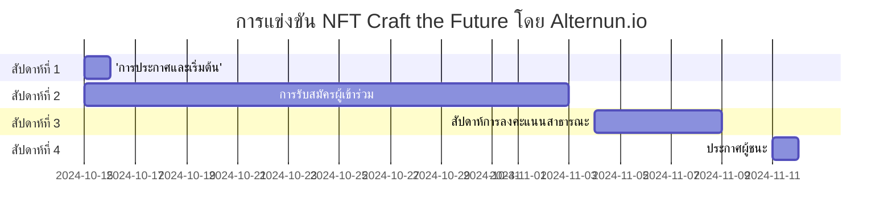

# ข้อมูลเบื้องต้น

## เป้าหมายของการแข่งขัน
ส่งเสริมการสร้างชิ้นงานศิลปะที่ไม่ซ้ำกันซึ่งอธิบายภารกิจและการดำเนินงานของ Alternun อย่างกราฟิก สร้างความสนใจในเรื่องการโทเคนสินทรัพย์จริง

## กำหนดการของการแข่งขัน

| ขั้นตอน                     | วันที่                     |
| --------------------------- | ------------------------- |
| การประกาศและเริ่มต้น      | 15 ตุลาคม                |
| การรับสมัครผู้เข้าร่วม     | 15 ตุลาคม - 3 พฤศจิกายน |
| สัปดาห์การลงคะแนนสาธารณะ | 4 พฤศจิกายน - 8 พฤศจิกายน |
| ประกาศผู้ชนะ              | 11 พฤศจิกายน             |

## รางวัล

| ตำแหน่ง                       | ศิลปินที่ได้รับการคัดเลือก                     | จำนวนเงิน(USD) |
| ------------------------------ | ----------------------------------- | ----------- |
| อันดับ 1                      | ศิลปิน 1 คนที่ได้รับการคัดเลือกจากชุมชน      | $200        |
| อันดับ 2                      | ศิลปิน 1 คนที่ได้รับการคัดเลือกจากชุมชน | $100        |
| อันดับ 3                      | ศิลปิน 1 คนที่ได้รับการคัดเลือกจากชุมชน | $50         |
| เกณฑ์สำหรับการมีส่วนร่วมทางสังคม | 17 ศิลปินชั้นนำ                       | $10 (แต่ละคน)  |

:::info
ผู้เข้าร่วมทุกคนจะได้รับประสบการณ์ที่มีค่า ซึ่งจะนำมาพิจารณาในงานการสร้างโทเคนของ Alternun (TGE Q1 2025) ผ่าน Zealy. \
รางวัลทั้งหมดจะถูกแจกจ่ายในสกุลเงินดิจิทัลพื้นเมืองของบล็อกเชน Stellar ซึ่งเทียบเท่ากับ USD. \
[ข้อมูลเกี่ยวกับ Stellar](https://stellarchain.io/)
:::
# คู่มือการลงทะเบียน

## เกณฑ์การมีสิทธิ์
- ผู้เข้าร่วมต้องมีอายุอย่างน้อย 18 ปี
- ผู้เข้าร่วมต้องมีบัญชี Zealy ที่ถูกต้อง
- ผลงานทั้งหมดต้องเป็นงานศิลปะต้นฉบับที่สร้างโดยผู้เข้าร่วม
- ผู้เข้าร่วมต้องกรอกแบบฟอร์มการลงทะเบียนเพื่อมีสิทธิ์ในการคัดเลือก

## ขั้นตอนการลงทะเบียนทีละขั้นตอน
:::tip
โปรดเชื่อมต่อกับ Discord เพื่อกรอกแบบฟอร์มการลงทะเบียน
:::

1. **กรอกแบบฟอร์มการลงทะเบียน**
   - เข้าร่วมชุมชนของเราที่ [Zealy 🔗](https://zealy.io/cw/alternun/invite/TTVWe--hMN2Y3N-ibl-XV).
   - กรอกแบบฟอร์มการลงทะเบียนศิลปิน [🔗](https://zealy.io/cw/alternun/questboard/c7da4780-1ad0-4ad8-8cb8-affbcff91ab2/1a7427e2-4ac4-4d0f-abb2-23ad8e19e456)
   - **การลงทะเบียนที่ง่ายขึ้น**: คุณยังสามารถลงทะเบียนได้โดยการให้ที่อยู่อีเมลของคุณที่ [ลิงก์นี้](https://xozsu5eiys2.typeform.com/to/MuDsJSqh). โปรดทราบว่าในขั้นตอนการส่งผลงานศิลปะของคุณ คุณต้องติดตามเราบน Twitter และ Discord ผ่าน Zealy ด้วย
2. **รับคู่มือในอีเมลของคุณ**
   - หลังจากส่งแบบฟอร์มแล้ว โปรดตรวจสอบอีเมลของคุณ
   - คุณจะได้รับอีเมลพร้อมคำแนะนำเกี่ยวกับวิธีการอัปโหลดลิงก์ไปยัง NFT ของคุณในแกลเลอรีและในบล็อกเชนที่คุณเลือก

3. **อัปโหลด NFT ของคุณ**
   - ปฏิบัติตามคำแนะนำที่ให้ไว้ในอีเมลเพื่ออัปโหลดผลงานศิลปะของคุณไปยังแกลเลอรีและเชื่อมโยงกับบล็อกเชนที่คุณเลือก

4. **แคมเปญการคัดเลือกศิลปิน**
   - เข้าร่วมแคมเปญ Zealy ซึ่ง **17 ศิลปินที่ดีที่สุด** จะถูกคัดเลือกผ่านการลงคะแนนสาธารณะ
   - กระบวนการคัดเลือกจากชุมชนเกี่ยวข้องกับการทำภารกิจของ Zealy ที่ส่งเสริมการมีส่วนร่วมในโซเชียลมีเดีย ผู้เข้าร่วมสามารถรับคะแนนโดยการแชร์ผลงานศิลปะของตนและมีส่วนร่วมกับชุมชนในหลายแพลตฟอร์ม
   - นอกจากนี้ยังสนับสนุนให้ศิลปินเรียนรู้จากเอกสารของ Alternun และทำแบบสอบถามกระบวนการเพื่อทำความเข้าใจโครงการให้ดีขึ้นและปรับปรุงการนำเสนอของตน

## คู่มือสไตล์ศิลปะและข้อกำหนดการนำเสนอ
- ไม่มีข้อจำกัดเกี่ยวกับประเภทของศิลปะที่คุณสามารถนำเสนอ; คุณสามารถใช้วิดีโอ, GIF หรือภาพ
- อย่างไรก็ตาม ห้ามรวมไอโซโทปหรือโลโก้ของ Alternun ในผลงานศิลปะของคุณ
- ผลงานศิลปะทั้งหมดที่นำเสนอจะต้องเผยแพร่ในแกลเลอรี เช่น OpenSea หรือแกลเลอรีบล็อกเชนอื่น ๆ
- สามารถใช้เครื่องมือ AI ในการสร้างศิลปะได้ แต่โปรดมั่นใจว่าคุณได้ใส่จิตวิญญาณของคุณในกระบวนการ
- รูปแบบการนำเสนอจะต้องเป็น 1:1 โดยมีความละเอียดขั้นต่ำ 2400px
- คุณต้องนำเสนอผลงานกราฟิกอย่างน้อย 1 ชิ้นและสูงสุด 3 ชิ้นในฐานะชุด NFT
- สำหรับแรงบันดาลใจ โปรดเยี่ยมชมหน้าแลนดิ้งของการแข่งขันที่ [craft-the-future.alternun.io](https://craft-the-future.alternun.io).

:::warning
- ผลงานทั้งหมดไม่ควรมีเนื้อหารุนแรง, รุนแรงหรือมีเนื้อหาทางเพศที่ชัดเจน เราสนับสนุนความคิดสร้างสรรค์ในขณะที่มั่นใจว่าสภาพแวดล้อมที่เคารพและรวมทุกคน
:::

## ทรัพย์สินทางปัญญาและสิทธิ
- สิทธิทางปัญญาและการค้า NFT เป็นของศิลปิน 
- ศิลปินอนุญาตให้ Alternun ใช้งานผลงานในสิ่งพิมพ์ของ Alternun และในเว็บไซต์ของเรา โดยจะมีการให้เครดิตแก่ผู้เขียนเสมอ

## คำแนะนำกระเป๋าเงิน
เพื่อรับรางวัลในบล็อกเชน Stellar เราขอแนะนำให้ติดตั้งกระเป๋าเงิน LOBSTR

:::info
[⏬ กระเป๋าเงิน LOBSTR ](https://lobstr.co/)
:::

LOBSTR เป็นกระเป๋าเงินที่ใช้งานง่ายและปลอดภัยสำหรับจัดการสินทรัพย์ Stellar ของคุณ รวมถึง XLM มีคุณสมบัติดังนี้:
- อินเทอร์เฟซที่เรียบง่ายและใช้งานง่าย
- Google 2FA
- รองรับสินทรัพย์ Stellar
- ความปลอดภัยด้วย PIN และลายนิ้วมือ
- กราฟสด
- รองรับ QR Code
- การแจ้งเตือนแบบพุชสำหรับธุรกรรม
- การจัดเก็บข้อมูลอย่างปลอดภัย

## ขอให้โชคดี!

เราหวังว่าจะได้เห็นศิลปะของคุณในการแข่งขันและวิธีที่คุณมีส่วนร่วมในการกำหนดอนาคตของการขุดดิจิทัลและโครงการ DeFi ผ่านศิลปะ NFT

### สัปดาห์การลงคะแนนสาธารณะ (4 พฤศจิกายน - 8 พฤศจิกายน)
- **กระบวนการลงคะแนน**:
  - เผยแพร่ผลงานที่ดีที่สุด 3 ชิ้นในแกลเลอรีเสมือนจริงบนเว็บไซต์ของ Alternun
  - ระบบการลงคะแนนผ่าน Alternun DAO
  
- **การส่งเสริมการลงคะแนน**:
  - โพสต์ประจำวันใน Instagram และ Twitter เพื่อเตือนชุมชนให้ลงคะแนน
  - สร้างแคมเปญแฮชแท็กเพื่อกระตุ้นการมีส่วนร่วม

### ประกาศผู้ชนะ

11 พฤศจิกายน ผ่าน Alternun X