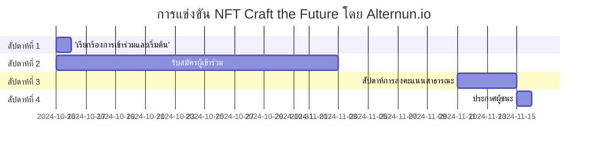

# ทั่วไป

## วัตถุประสงค์ของการแข่งขัน
ส่งเสริมการสร้างผลงานศิลปะที่ไม่ซ้ำกันซึ่งอธิบายภารกิจและการดำเนินงานของ Alternun โดยกราฟิก เพื่อสร้างความสนใจในกระบวนการโทเค็นของสินทรัพย์จริง

## กำหนดการของการแข่งขัน

| ระยะ                      | วันที่                    |
| -------------------------- | ------------------------ |
| เรียกร้องการเข้าร่วมและเริ่มต้น | 15 ตุลาคม               |
| รับสมัครผู้เข้าร่วม  | 15 ตุลาคม - 8 พฤศจิกายน  |
| สัปดาห์การลงคะแนนสาธารณะ         | 11 พฤศจิกายน - 15 พฤศจิกายน |
| ประกาศผู้ชนะ    | 15 พฤศจิกายน              |

## รางวัล

| ตำแหน่ง                       | ศิลปินที่ได้รับการเลือก                     | จำนวน(USD) |
| ------------------------------ | ----------------------------------- | ----------- |
| อันดับ 1                      | ศิลปิน 1 คนที่ได้รับการเลือกโดยชุมชน      | $200        |
| อันดับ 2                      | ศิลปิน 1 คนที่ได้รับการเลือกโดยชุมชน | $100        |
| อันดับ 3                      | ศิลปิน 1 คนที่ได้รับการเลือกโดยชุมชน | $50         |
| เกณฑ์สำหรับการมีส่วนร่วมทางสังคม | ศิลปิน 17 คนที่ดีที่สุด                       | $10 (แต่ละคน)  |

:::info
ผู้เข้าร่วมทุกคนจะได้รับประสบการณ์ที่มีค่า ซึ่งจะถูกนำมาพิจารณาในเหตุการณ์การสร้างโทเค็นของ Alternun (TGE Q1 2025) ผ่าน Zealy. \
รางวัลทั้งหมดจะถูกแจกจ่ายในสกุลเงินดิจิทัลที่เทียบเท่ากับ USD บนบล็อกเชน Stellar. \
[ข้อมูล Stellar](https://stellarchain.io/)
:::
# คู่มือการลงทะเบียน

## เกณฑ์คุณสมบัติ
- ผู้เข้าร่วมต้องมีอายุอย่างน้อย 18 ปี
- ผู้เข้าร่วมควรมีบัญชี Zealy ที่ถูกต้อง
- ผลงานที่ส่งต้องเป็นงานศิลปะต้นฉบับที่สร้างโดยผู้เข้าร่วม
- ผู้เข้าร่วมต้องกรอกแบบฟอร์มการลงทะเบียนเพื่อมีสิทธิ์ในการเลือก

## ขั้นตอนการลงทะเบียนทีละขั้นตอน
:::tip
โปรดเชื่อมต่อกับ Discord เพื่อกรอกแบบฟอร์มการลงทะเบียน
:::

1. **กรอกแบบฟอร์มการลงทะเบียน**
   - เข้าร่วมชุมชนของเราที่ [Zealy 🔗](https://zealy.io/cw/alternun/invite/TTVWe--hMN2Y3N-ibl-XV).
   - กรอกแบบฟอร์มการลงทะเบียนศิลปิน. [🔗](https://zealy.io/cw/alternun/questboard/c7da4780-1ad0-4ad8-8cb8-affbcff91ab2/1a7427e2-4ac4-4d0f-abb2-23ad8e19e456)
   - **การลงทะเบียนที่ง่ายขึ้น**: คุณสามารถลงทะเบียนโดยการให้ที่อยู่อีเมลของคุณที่ [ลิงก์นี้](https://xozsu5eiys2.typeform.com/to/MuDsJSqh). โปรดทราบว่าในขั้นตอนการส่งผลงานของคุณ คุณต้องติดตามเราบน Twitter และ Discord ผ่าน Zealy.
2. **รับคู่มือในอีเมลของคุณ**
   - หลังจากส่งแบบฟอร์มแล้ว ให้ตรวจสอบอีเมลของคุณ
   - คุณจะได้รับอีเมลพร้อมคำแนะนำเกี่ยวกับวิธีการเชื่อมโยงลิงก์ไปยัง NFT ของคุณในแกลเลอรีและบนบล็อกเชนที่คุณเลือก

3. **เชื่อมโยง NFT ของคุณ**
   - ปฏิบัติตามคำแนะนำที่ให้ไว้ในอีเมลเพื่ออัปโหลดผลงานของคุณไปยังแกลเลอรีและเชื่อมโยงกับบล็อกเชนที่คุณเลือก

4. **แคมเปญการเลือกศิลปิน**
   - เข้าร่วมแคมเปญ Zealy ซึ่ง **ศิลปิน 17 คนที่ดีที่สุด** จะถูกเลือกผ่านการลงคะแนนสาธารณะ
   - กระบวนการเลือกของชุมชนเกี่ยวข้องกับการทำภารกิจ Zealy ที่กระตุ้นการมีส่วนร่วมในโซเชียลมีเดีย ผู้เข้าร่วมสามารถรับคะแนนโดยการแชร์ผลงานของตนและมีส่วนร่วมกับชุมชนในแพลตฟอร์มต่างๆ
   - นอกจากนี้ ศิลปินยังได้รับการสนับสนุนให้เรียนรู้จากเอกสาร Alternun และทำแบบทดสอบกระบวนการเพื่อทำความเข้าใจโครงการและปรับปรุงผลงานของตน

## คู่มือสไตล์ศิลปะและข้อกำหนดการส่ง
- ไม่มีข้อจำกัดเกี่ยวกับประเภทของศิลปะที่คุณสามารถส่งได้; คุณสามารถใช้วิดีโอ, GIF หรือภาพถ่าย
- อย่างไรก็ตาม โปรดอย่าใส่สัญลักษณ์หรือโลโก้จาก Alternun ในผลงานของคุณ
- ผลงานที่ส่งทั้งหมดต้องโพสต์ในแกลเลอรี เช่น OpenSea หรือแกลเลอรีบล็อกเชนอื่นๆ
- การใช้เครื่องมือ AI ในการสร้างศิลปะนั้นได้รับอนุญาต แต่โปรดมั่นใจว่าคุณได้ใส่จิตวิญญาณของคุณลงไปในกระบวนการ
- รูปแบบการส่งต้องเป็น 1:1 โดยมีความละเอียดขั้นต่ำ 2400px
- คุณต้องส่งผลงานกราฟิกอย่างน้อย 1 ชิ้นและสูงสุด 3 ชิ้นในชุด NFT
- สำหรับแรงบันดาลใจ โปรดเยี่ยมชมหน้าแลนดิ้งของการแข่งขันที่ [craft-the-future.alternun.io](https://craft-the-future.alternun.io).
1. **Fill Out the Registration Form**
   - Join our community at [Zealy 🔗](https://zealy.io/cw/alternun/invite/TTVWe--hMN2Y3N-ibl-XV).
   - Complete the artist registry form. [🔗](https://zealy.io/cw/alternun/questboard/c7da4780-1ad0-4ad8-8cb8-affbcff91ab2/1a7427e2-4ac4-4d0f-abb2-23ad8e19e456)
   - **Simplified Registration**: You can also register by simply providing your email at [this link](https://xozsu5eiys2.typeform.com/to/MuDsJSqh). Please note that on the submition pashe of your artwork, you must also follow us on Twitter and Discord via Zealy.
2. **Receive the Guide in Your Email**
   - After submitting the form, check your email.
   - You will receive an email with instructions on how to mount the link to your NFT in the gallery and on your preferred blockchain.

3. **Mount Your NFT**
   - Follow the instructions provided in the email to upload your artwork to the gallery and link it to the blockchain of your choice.

4. **Artist Selection Campaign**
   - Participate in the Zealy campaign, where the **top 17 artists** will be selected through public voting.
   - The community selection process involves completing Zealy quests that encourage social media engagement. Participants can earn points by sharing their artwork and engaging with the community on various platforms.
   - Additionally, artists are encouraged to learn from the Alternun documentation and complete process quizzes to better understand the project and enhance their submissions.

## Art Style Guide and Submission Requirements
- There are no restrictions on the type of art you can submit; you may use video, GIF, or images.
- However, please do not include any isotypes or logos from Alternun in your artwork.
- All submitted art must be posted in a gallery, such as OpenSea or another blockchain gallery.
- The use of AI tools for generating art is allowed, but make sure to infuse your soul into the process.
- Submission format must be 1:1 with a minimum resolution of 2400px.
- You must submit a minimum of one graphic piece and a maximum of 3 as an NFT series.
- For inspiration, visit the contest landing page at [craft-the-future.alternun.io](https://craft-the-future.alternun.io).

:::warning
- All submissions must not contain any racist, violent, or sexually explicit content. We encourage creativity while ensuring a respectful and inclusive environment for all participants.
:::

## Intellectual Property and Rights
- the intellectual and commercial rights of the NFT are the property of the artist. 
- The artist grants Alternun authorization to use the work in Alternun's own publications and on our sites, always acknowledging the author.

## Wallet Recommendation
To receive prizes on the Stellar blockchain, we recommend installing the LOBSTR wallet

:::info
[⏬ LOBSTR Wallet ](https://lobstr.co/)
:::

LOBSTR is a user-friendly and secure wallet for managing your Stellar assets, including XLM. It offers features such as:
- Simple and intuitive interface
- Google 2FA
- Support for Stellar assets
- PIN and fingerprint security
- Live charts
- QR code support
- Push notifications for transactions
- Secure data storage

## Good Luck!

We look forward to seeing your art in the contest and how you contribute to redefining the future of digital mining and DeFi projects through NFT art.

### Public Voting Week ( November 8 - November 11)
- **Voting Process**:
  - Publish top3 received works in a virtual gallery on the Alternun website.
  - voting system via Alternun DAO
  
- **Promotion of Voting**:
  - Daily posts on Instagram and Twitter to remind the community to vote.
  - Create a hashtag campaign to encourage participation.

### Announcement of Winners

November 15 Via Alternun X
