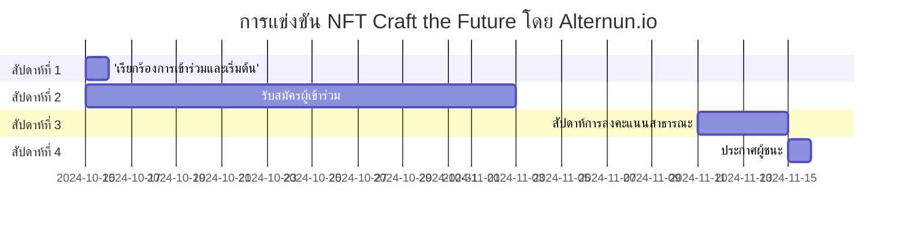

# ทั่วไป

## วัตถุประสงค์ของการแข่งขัน

ส่งเสริมการสร้างผลงานศิลปะที่ไม่ซ้ำกันซึ่งอธิบายภารกิจและการดำเนินงานของ Alternun โดยกราฟิก เพื่อสร้างความสนใจในกระบวนการโทเค็นของสินทรัพย์จริง

## กำหนดการของการแข่งขัน

| ระยะ                            | วันที่                      |
| ------------------------------- | --------------------------- |
| เรียกร้องการเข้าร่วมและเริ่มต้น | 15 ตุลาคม                   |
| รับสมัครผู้เข้าร่วม             | 15 ตุลาคม - 11 พฤศจิกายน    |
| สัปดาห์การลงคะแนนสาธารณะ        | 11 พฤศจิกายน - 15 พฤศจิกายน |
| ประกาศผู้ชนะ                    | 15 พฤศจิกายน                |

## รางวัล

| ตำแหน่ง                          | ศิลปินที่ได้รับการเลือก              | จำนวน(USD)    |
| -------------------------------- | ------------------------------------ | ------------- |
| อันดับ 1                         | ศิลปิน 1 คนที่ได้รับการเลือกโดยชุมชน | $200          |
| อันดับ 2                         | ศิลปิน 1 คนที่ได้รับการเลือกโดยชุมชน | $100          |
| อันดับ 3                         | ศิลปิน 1 คนที่ได้รับการเลือกโดยชุมชน | $50           |
| เกณฑ์สำหรับการมีส่วนร่วมทางสังคม | ศิลปิน 17 คนที่ดีที่สุด              | $10 (แต่ละคน) |

:::info
ผู้เข้าร่วมทุกคนจะได้รับประสบการณ์ที่มีค่า ซึ่งจะถูกนำมาพิจารณาในเหตุการณ์การสร้างโทเค็นของ Alternun (TGE Q1 2025) ผ่าน Zealy. \
รางวัลทั้งหมดจะถูกแจกจ่ายในสกุลเงินดิจิทัลที่เป็นพื้นฐานของ Stellar Blockchain $XLM. \
[ข้อมูล Stellar](https://stellarchain.io/)
:::

# คู่มือการลงทะเบียน

:::danger
**สำคัญ:** การลงทะเบียนสำหรับศิลปินจะปิดที่ **23:11 น. EST ในวันที่ 11 พฤศจิกายน** กรุณาทำการลงทะเบียนให้เสร็จก่อนถึงกำหนดนี้!
:::

## เกณฑ์คุณสมบัติ

- ผู้เข้าร่วมต้องมีอายุอย่างน้อย 18 ปี
- ผู้เข้าร่วมควรมีบัญชี Zealy ที่ถูกต้อง
- ผลงานที่ส่งต้องเป็นผลงานศิลปะที่สร้างขึ้นโดยผู้เข้าร่วมเอง
- ผู้เข้าร่วมต้องกรอกแบบฟอร์มการลงทะเบียนเพื่อมีสิทธิ์ในการเลือก

## ขั้นตอนการลงทะเบียนทีละขั้นตอน

:::tip
โปรดเชื่อมต่อกับ Discord เพื่อกรอกแบบฟอร์มการลงทะเบียน
:::

1. **กรอกแบบฟอร์มการลงทะเบียน**
   - เข้าร่วมชุมชนของเราที่ [Zealy 🔗](https://zealy.io/cw/alternun/invite/TTVWe--hMN2Y3N-ibl-XV).
   - กรอกแบบฟอร์มการลงทะเบียนศิลปิน [🔗](https://zealy.io/cw/alternun/questboard/c7da4780-1ad0-4ad8-8cb8-affbcff91ab2/1a7427e2-4ac4-4d0f-abb2-23ad8e19e456)
   - **การลงทะเบียนที่ง่ายขึ้น**: คุณยังสามารถลงทะเบียนโดยการให้ที่อยู่อีเมลของคุณที่ [ลิงก์นี้](https://xozsu5eiys2.typeform.com/to/MuDsJSqh). โปรดทราบว่าในขั้นตอนการส่งผลงานของคุณ คุณต้องติดตามเราบน Twitter และ Discord ผ่าน Zealy ด้วย
2. **รับคู่มือในอีเมลของคุณ**

   - หลังจากส่งแบบฟอร์มแล้ว ให้ตรวจสอบอีเมลของคุณ
   - คุณจะได้รับอีเมลพร้อมคำแนะนำเกี่ยวกับวิธีการเชื่อมโยงผลงาน NFT ของคุณในแกลเลอรีและบนบล็อกเชนที่คุณเลือก

3. **เชื่อมโยง NFT ของคุณ**

   - ปฏิบัติตามคำแนะนำที่ให้ไว้ในอีเมลเพื่ออัปโหลดผลงานของคุณไปยังแกลเลอรีและเชื่อมโยงกับบล็อกเชนที่คุณเลือก

4. **แคมเปญการเลือกศิลปิน**
   - เข้าร่วมแคมเปญ Zealy ซึ่ง **ศิลปิน 17 คนที่ดีที่สุด** จะถูกเลือกผ่านการลงคะแนนสาธารณะ
   - กระบวนการเลือกโดยชุมชนเกี่ยวข้องกับการทำภารกิจ Zealy ที่กระตุ้นการมีส่วนร่วมในโซเชียลมีเดีย ผู้เข้าร่วมสามารถรับคะแนนโดยการแชร์ผลงานของตนและมีส่วนร่วมกับชุมชนในแพลตฟอร์มต่างๆ
   - นอกจากนี้ ศิลปินยังได้รับการสนับสนุนให้เรียนรู้จากเอกสาร Alternun และทำแบบทดสอบกระบวนการเพื่อทำความเข้าใจโครงการและปรับปรุงผลงานของตน

## คู่มือสไตล์ศิลปะและข้อกำหนดการส่งผลงาน

- ไม่มีข้อจำกัดเกี่ยวกับประเภทของศิลปะที่คุณสามารถส่งได้ คุณสามารถใช้วิดีโอ, GIF หรือภาพ
- อย่างไรก็ตาม โปรดอย่าใส่สัญลักษณ์หรือโลโก้จาก Alternun ในผลงานของคุณ
- ผลงานที่ส่งทั้งหมดต้องถูกโพสต์ในแกลเลอรี เช่น OpenSea หรือแกลเลอรีบล็อกเชนอื่นๆ
- การใช้เครื่องมือ AI ในการสร้างศิลปะนั้นได้รับอนุญาต แต่โปรดมั่นใจว่าคุณได้ใส่จิตวิญญาณของคุณลงไปในกระบวนการ
- รูปแบบการส่งต้องเป็น 1:1 โดยมีความละเอียดขั้นต่ำ 2400px
- คุณต้องส่งผลงานกราฟิกอย่างน้อย 1 ชิ้นและสูงสุด 3 ชิ้นในรูปแบบ NFT ซีรีส์
- สำหรับแรงบันดาลใจ โปรดเยี่ยมชมหน้าแลนดิ้งของการแข่งขันที่ [craft-the-future.alternun.io](https://craft-the-future.alternun.io).

:::warning

- ผลงานที่ส่งทั้งหมดต้องไม่มีเนื้อหาที่เหยียดเชื้อชาติ, รุนแรง หรือมีเนื้อหาทางเพศที่ชัดเจน เราสนับสนุนความคิดสร้างสรรค์ในขณะที่มั่นใจว่าสภาพแวดล้อมที่เคารพและรวมทุกคน
  :::

## ทรัพย์สินทางปัญญาและสิทธิ

- สิทธิทางปัญญาและการค้าเกี่ยวกับ NFT เป็นทรัพย์สินของศิลปิน
- ศิลปินให้สิทธิ์ Alternun ในการใช้ผลงานในสิ่งพิมพ์ของ Alternun และในเว็บไซต์ของเรา โดยจะมีการยกย่องผู้เขียนเสมอ

## คำแนะนำเกี่ยวกับกระเป๋าเงิน

เพื่อรับรางวัลบนบล็อกเชน Stellar เราขอแนะนำให้ติดตั้งกระเป๋าเงิน LOBSTR

:::info
[⏬ กระเป๋าเงิน LOBSTR ](https://lobstr.co/)
:::

LOBSTR เป็นกระเป๋าเงินที่ใช้งานง่ายและปลอดภัยสำหรับการจัดการสินทรัพย์ Stellar ของคุณ รวมถึง XLM มันมีฟีเจอร์เช่น:

- อินเทอร์เฟซที่เรียบง่ายและใช้งานง่าย
- Google 2FA
- รองรับสินทรัพย์ Stellar
- ความปลอดภัยด้วย PIN และลายนิ้วมือ
- แผนภูมิสด
- รองรับ QR code
- การแจ้งเตือนแบบพุชสำหรับธุรกรรม
- การจัดเก็บข้อมูลที่ปลอดภัย

## ขอให้โชคดี!

เราหวังว่าจะได้เห็นผลงานศิลปะของคุณในการแข่งขันและวิธีที่คุณมีส่วนร่วมในการกำหนดอนาคตของการขุดดิจิทัลและโครงการ DeFi ผ่านศิลปะ NFT

### สัปดาห์การลงคะแนนสาธารณะ ( 8 พฤศจิกายน - 11 พฤศจิกายน)

- **กระบวนการลงคะแนน**:
  - เผยแพร่ผลงานที่ได้รับการคัดเลือก 3 อันดับแรกในแกลเลอรีเสมือนบนเว็บไซต์ Alternun
  - ระบบการลงคะแนนผ่าน Alternun DAO
- **การส่งเสริมการลงคะแนน**:
  - โพสต์ประจำวันบน Instagram และ Twitter เพื่อเตือนชุมชนให้ลงคะแนน
  - สร้างแคมเปญแฮชแท็กเพื่อกระตุ้นการมีส่วนร่วม

### ประกาศผู้ชนะ

15 พฤศจิกายน ผ่าน Alternun X
