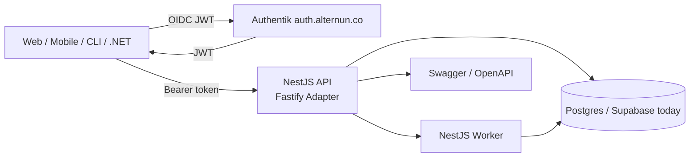
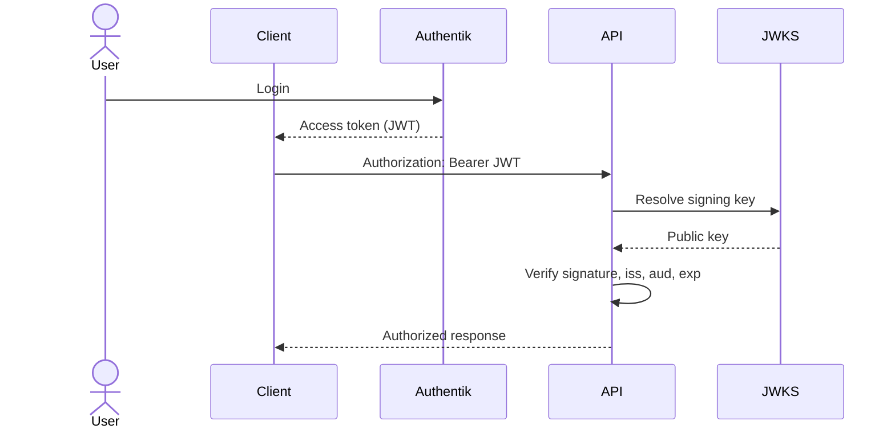
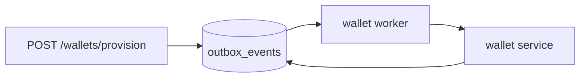
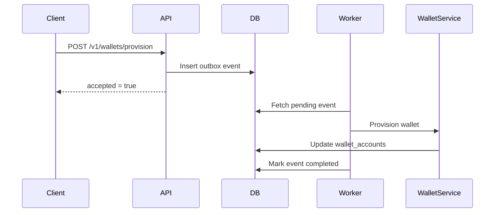

# Alternun Backend Blueprint

**Stack:** NestJS + Fastify Adapter + OpenAPI/Swagger
**Primary Auth:** Authentik (`https://auth.alternun.co`)
**Current Data Platform:** Supabase/Postgres
**Goal:** Lean, portable, OpenAPI-first backend with minimal vendor lock-in

---

# 1. Purpose

This document defines the recommended backend architecture for Alternun using:

- **NestJS** as the application framework
- **Fastify** as the HTTP adapter/runtime
- **OpenAPI/Swagger** as the API contract layer
- **Authentik** as the identity provider
- **Postgres** as the application source of truth
- **Supabase** as the current Postgres/data platform, without locking business logic into Supabase-specific patterns

This backend is intended to handle:

- user bootstrap and identity sync
- wallet provisioning workflows
- organization and membership logic
- async domain jobs
- internal and external webhooks
- a clean REST API consumable by TS, mobile, .NET, Python, Go, and CLI tooling

---

# 2. High-Level Architecture



---

# 3. Responsibility Split

## Authentik

Handles:

- login
- MFA
- social auth
- OIDC/OAuth2 flows
- JWT issuance
- identity source of truth

## NestJS API

Handles:

- JWT verification
- request validation
- domain orchestration
- REST endpoints
- OpenAPI contract
- sync between identity claims and app tables
- secure wallet and org operations

## NestJS Worker

Handles:

- async wallet provisioning
- retries
- webhook processing
- queued background jobs
- outbox event consumption

## Postgres

Handles:

- application state
- users
- organizations
- memberships
- wallets
- audit logs
- outbox jobs

## Supabase

Current role:

- Postgres hosting and access platform
- optional direct CRUD/realtime/storage layer
- **not** the home of critical business logic

---

# 4. Recommended Backend Shape

Add a backend app in the monorepo:

```text
apps/api
├─ src
│  ├─ main.ts
│  ├─ app.module.ts
│  ├─ common
│  │  ├─ auth
│  │  │  ├─ jwt-auth.guard.ts
│  │  │  ├─ authentik-jwks.service.ts
│  │  │  ├─ current-user.decorator.ts
│  │  │  └─ current-user.types.ts
│  │  ├─ config
│  │  ├─ filters
│  │  ├─ interceptors
│  │  ├─ pipes
│  │  └─ openapi
│  ├─ modules
│  │  ├─ health
│  │  ├─ users
│  │  ├─ auth-sync
│  │  ├─ wallets
│  │  ├─ organizations
│  │  └─ webhooks
│  ├─ db
│  │  ├─ client.ts
│  │  ├─ schema
│  │  └─ migrations
│  └─ jobs
│     ├─ jobs.module.ts
│     └─ wallet-provision.processor.ts
└─ test
```

Optional later split:

```text
apps/worker
```

if the worker should be deployed separately.

---

# 5. Why NestJS + Fastify

## Why NestJS

Best for:

- modular architecture
- long-term maintainability
- auth guards
- DTOs and validation
- background job coordination
- multi-team consistency

## Why Fastify

Best for:

- lower overhead
- better runtime performance
- lean request handling
- clean production behavior

## Combined Recommendation

Use:

- **NestJS** for structure
- **Fastify adapter** for runtime

This is the best balance between performance and maintainability.

---

# 6. Authentication Model

## Issuer

Authentik will live at:

```text
https://auth.alternun.co
```

## Backend Auth Flow



## Required JWT checks

The backend must verify:

- signature
- issuer (`iss`)
- audience (`aud`)
- expiration (`exp`)
- optional claims like role/org

## Current user claims model

```ts
export interface CurrentUserClaims {
  iss: string;
  sub: string;
  email?: string;
  role?: string;
  org_id?: string;
  roles?: string[];
}
```

---

# 7. Identity Mapping Strategy

The backend must map Authentik identities into application-owned tables.

## Canonical external identity

Use:

- `iss`
- `sub`

Never use:

- email as primary identity
- `auth.users.id` as canonical business identity

## Core tables

### identity_principals

```text
id uuid pk
issuer text not null
subject text not null
email text null
created_at timestamptz
updated_at timestamptz
unique (issuer, subject)
```

### app_users

```text
id uuid pk
principal_id uuid not null references identity_principals(id)
display_name text null
avatar_url text null
status text not null
created_at timestamptz
updated_at timestamptz
```

### wallet_accounts

```text
id uuid pk
app_user_id uuid not null references app_users(id)
chain text not null
kind text not null
custody text not null
address text null
status text not null
signer_ref text null
created_at timestamptz
updated_at timestamptz
```

### outbox_events

```text
id uuid pk
event_type text not null
aggregate_type text not null
aggregate_id uuid not null
payload jsonb not null
status text not null default 'pending'
attempts int not null default 0
created_at timestamptz
processed_at timestamptz null
```

### audit_logs

```text
id uuid pk
entity_type text not null
entity_id uuid not null
action text not null
actor_principal_id uuid null
metadata jsonb
created_at timestamptz
```

---

# 8. OpenAPI / Swagger Blueprint

## Goal

Swagger must be the **official API contract**.

It should support:

- frontend teams
- mobile teams
- generated clients
- .NET/Python/Go integration
- internal admin tools

## Documentation endpoints

```text
/docs
/docs-json
```

## Required Swagger rules

Every public route should define:

- `@ApiTags`
- `@ApiOperation`
- `@ApiBearerAuth` for protected routes
- request DTO
- response DTO
- error DTOs
- `@ApiOkResponse`, `@ApiCreatedResponse`
- `@ApiBadRequestResponse`
- `@ApiUnauthorizedResponse`
- `@ApiForbiddenResponse` where relevant

## Versioning

Use URI versioning:

```text
/v1/...
```

## Tag structure

Recommended tags:

- `health`
- `users`
- `auth-sync`
- `wallets`
- `organizations`
- `webhooks`

---

# 9. Swagger Setup Example

## main.ts

```ts
import { NestFactory } from '@nestjs/core';
import { FastifyAdapter, NestFastifyApplication } from '@nestjs/platform-fastify';
import { ValidationPipe, VersioningType } from '@nestjs/common';
import { SwaggerModule, DocumentBuilder } from '@nestjs/swagger';
import { AppModule } from './app.module';

async function bootstrap() {
  const app = await NestFactory.create<NestFastifyApplication>(
    AppModule,
    new FastifyAdapter({ logger: true })
  );

  app.setGlobalPrefix('v1');
  app.enableVersioning({ type: VersioningType.URI });

  app.useGlobalPipes(
    new ValidationPipe({
      whitelist: true,
      transform: true,
      forbidNonWhitelisted: true,
    })
  );

  const config = new DocumentBuilder()
    .setTitle('Alternun API')
    .setDescription('Alternun domain backend')
    .setVersion('1.0.0')
    .addBearerAuth(
      {
        type: 'http',
        scheme: 'bearer',
        bearerFormat: 'JWT',
        description: 'Authentik access token',
      },
      'bearer'
    )
    .build();

  const document = SwaggerModule.createDocument(app, config);
  SwaggerModule.setup('docs', app, document);

  await app.listen(3000, '0.0.0.0');
}

bootstrap();
```

---

# 10. Route Design Blueprint

Use resource-oriented REST.

## Recommended routes

```text
GET    /v1/health

GET    /v1/me
PATCH  /v1/me

POST   /v1/auth/sync

GET    /v1/wallets
POST   /v1/wallets/provision
GET    /v1/wallets/:walletId
POST   /v1/wallets/:walletId/link
POST   /v1/wallets/:walletId/sign

GET    /v1/organizations
POST   /v1/organizations
GET    /v1/organizations/:orgId
POST   /v1/organizations/:orgId/invites
GET    /v1/organizations/:orgId/members

POST   /v1/webhooks/authentik
```

## Route classification

### Public

- `/v1/health`
- signed webhook routes

### Protected

- everything user-specific or domain-specific

---

# 11. DTO Design Rules

## Request DTO example

```ts
import { ApiProperty } from '@nestjs/swagger';
import { IsIn, IsOptional, IsString } from 'class-validator';

export class ProvisionWalletDto {
  @ApiProperty({ example: 'evm' })
  @IsString()
  @IsIn(['evm', 'solana'])
  chain!: 'evm' | 'solana';

  @ApiProperty({ example: 'smart_account', required: false })
  @IsOptional()
  @IsString()
  @IsIn(['smart_account', 'custodial'])
  mode?: 'smart_account' | 'custodial';
}
```

## Response DTO example

```ts
import { ApiProperty } from '@nestjs/swagger';

export class WalletDto {
  @ApiProperty()
  id!: string;

  @ApiProperty()
  chain!: string;

  @ApiProperty()
  address!: string;

  @ApiProperty()
  status!: string;

  @ApiProperty()
  custody!: string;
}
```

## Standard error DTO

```ts
import { ApiProperty } from '@nestjs/swagger';

export class ErrorResponseDto {
  @ApiProperty()
  statusCode!: number;

  @ApiProperty()
  message!: string;

  @ApiProperty()
  error!: string;
}
```

---

# 12. Controller Blueprint Example

```ts
import { Body, Controller, Get, Post, UseGuards } from '@nestjs/common';
import {
  ApiBearerAuth,
  ApiCreatedResponse,
  ApiOkResponse,
  ApiOperation,
  ApiTags,
  ApiUnauthorizedResponse,
} from '@nestjs/swagger';
import { JwtAuthGuard } from '../../common/auth/jwt-auth.guard';
import { WalletsService } from './wallets.service';
import { ProvisionWalletDto } from './dto/provision-wallet.dto';
import { WalletDto } from './dto/wallet.dto';
import { CurrentUser } from '../../common/auth/current-user.decorator';
import { CurrentUserClaims } from '../../common/auth/current-user.types';

@ApiTags('wallets')
@ApiBearerAuth('bearer')
@UseGuards(JwtAuthGuard)
@Controller('wallets')
export class WalletsController {
  constructor(private readonly walletsService: WalletsService) {}

  @Get()
  @ApiOperation({ summary: 'Get current user wallets' })
  @ApiOkResponse({ type: WalletDto, isArray: true })
  @ApiUnauthorizedResponse({ description: 'Missing or invalid JWT' })
  async getMyWallets(@CurrentUser() user: CurrentUserClaims): Promise<WalletDto[]> {
    return this.walletsService.getMyWallets(user);
  }

  @Post('provision')
  @ApiOperation({ summary: 'Queue wallet provisioning for current user' })
  @ApiCreatedResponse({ description: 'Provisioning request accepted' })
  async provisionWallet(
    @CurrentUser() user: CurrentUserClaims,
    @Body() dto: ProvisionWalletDto
  ): Promise<{ accepted: true }> {
    await this.walletsService.requestProvision(user, dto);
    return { accepted: true };
  }
}
```

---

# 13. Module Blueprint

## AuthModule

Responsibilities:

- JWT verification
- JWKS fetch/caching
- current user extraction
- issuer/audience validation

## UsersModule

Responsibilities:

- `GET /me`
- `PATCH /me`
- profile bootstrap
- principal-to-user mapping

## AuthSyncModule

Responsibilities:

- first-login sync
- principal upsert
- app user creation
- session bootstrap hooks

## WalletsModule

Responsibilities:

- wallet listing
- queue provisioning
- link external wallet
- sign operations
- audit logging

## OrganizationsModule

Responsibilities:

- org creation
- memberships
- invites
- role assignment

## WebhooksModule

Responsibilities:

- Authentik hooks
- external service callbacks
- signature verification

## JobsModule

Responsibilities:

- outbox polling
- retries
- wallet provisioning
- email and integration jobs

---

# 14. Database Access Recommendation

For core domain logic, use direct Postgres access rather than relying on Supabase client semantics.

## Recommended choices

### Preferred

- **Drizzle + PostgreSQL**

### Acceptable alternatives

- Prisma
- node-postgres

## Why Drizzle

- lean
- SQL-friendly
- portable
- good for advanced Postgres usage
- less magic than Prisma

---

# 15. Async Job Blueprint

Use a Postgres outbox pattern.

## Flow



## Why this is the best v1

- no Redis required
- no extra broker
- portable
- easy to reason about
- fits lean infrastructure

## Worker loop

1. fetch pending events
2. mark processing
3. execute
4. mark success or failure
5. retry with backoff

---

# 16. Wallet Provisioning Blueprint

Do not provision wallets inline in the request.

## Recommended flow



## Why

- faster user-facing response
- safer retries
- better failure recovery
- cleaner separation of concerns

---

# 17. Coding Standards

## Controllers

- keep thin
- validate input
- delegate to services
- no raw business logic

## Services

- own domain logic
- coordinate repositories and jobs
- do not depend on transport details

## Repositories

- own persistence logic
- isolate SQL/ORM access

## DTOs

- explicit request/response contracts
- no leaking internal DB models

## Guards

- verify JWTs
- attach typed current user

---

# 18. Deployment Blueprint

## Services

Recommended deployment units:

```text
alternun-api
alternun-worker
```

## Domains

```text
api.alternun.co
auth.alternun.co
docs.alternun.co
```

## Runtime shape

- API container
- worker container
- Authentik on separate service/instance
- Postgres on Supabase today

---

# 19. What Must Not Live in Supabase-Specific Logic

To avoid vendor lock-in, do **not** place critical domain workflows only in:

- Supabase Edge Functions
- Supabase Auth metadata
- `auth.users.id` as canonical business identity
- Supabase-only triggers for core orchestration

Instead, keep critical logic in:

- NestJS backend
- app-owned Postgres schema
- Authentik JWT identity model
- portable workers and repositories

---

# 20. Recommended First Implementation Plan

## Phase 1

- create `apps/api`
- wire NestJS + Fastify
- add Swagger/OpenAPI
- add health endpoint
- add JWT verification against Authentik
- add `GET /v1/me`

## Phase 2

- add identity tables
- add user sync logic
- add org module
- add wallet tables

## Phase 3

- add wallet provisioning endpoint
- add outbox worker
- add audit logging

## Phase 4

- move privileged domain flows behind backend
- keep simple CRUD in Supabase where appropriate

## Phase 5

- generate SDKs from OpenAPI
- add rate limits, metrics, tracing, and internal admin routes

---

# 21. Final Recommendation

The best backend architecture for Alternun is:

- **NestJS**
- **Fastify adapter**
- **OpenAPI-first route design**
- **Authentik JWT verification**
- **Drizzle + Postgres**
- **Postgres outbox worker**

This gives Alternun:

- strong architecture
- lean runtime
- real REST API
- multi-language compatibility
- minimal Supabase lock-in
- clean path to scale

---

# 22. Final Summary

```text
Authentik = Authentication
NestJS API = Domain Backend
Fastify = HTTP Runtime
Swagger/OpenAPI = Contract
Postgres = Source of Truth
Supabase = Current Data Platform
Worker = Async Execution
```

This is the recommended production blueprint for Alternun's backend.
