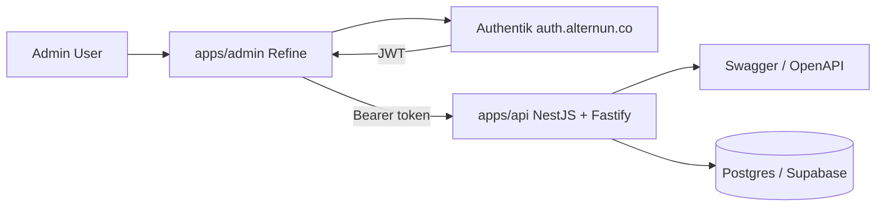

# [ADMIN] Integrate Refine as internal admin frontend on top of NestJS + Fastify + OpenAPI backend

## Summary

We need to add a dedicated **internal admin application** using **Refine** that consumes the Alternun backend API defined in the NestJS + Fastify + OpenAPI blueprint.

This admin app should provide a modern, maintainable, low-friction alternative to a Strapi-style admin UI without introducing a second backend platform or CMS dependency.

The target architecture is:

- **Authentik** for authentication at `https://auth.alternun.co`
- **NestJS + Fastify** as the backend API
- **Swagger/OpenAPI** as the backend contract
- **Refine** as the internal admin frontend
- **Postgres/Supabase** as the data platform behind the API

---

## Why this work is needed

We want the productivity and UX of a Strapi-style admin panel, but we do **not** want:

- a second backend system
- a CMS as our core product backend
- more infra to maintain than necessary
- business logic embedded in a stale or poorly aligned admin plugin

Refine is a better fit because it is a frontend/admin framework, not a backend abstraction.

That matches the architecture we already chose:

- NestJS backend remains the source of domain logic
- OpenAPI remains the API contract
- Refine becomes the admin UI layer on top

---

## Scope

This issue covers:

- creating `apps/admin`
- wiring Refine to the NestJS backend
- integrating Authentik login for admin users
- connecting Refine resources to our OpenAPI-backed endpoints
- building the first internal admin surfaces for:
  - users
  - wallets
  - organizations
  - memberships
  - audit views
- documenting the architecture and deployment model

This issue does **not** cover:

- replacing Docusaurus/Decap
- replacing the public product frontend
- moving business logic into Refine
- introducing Strapi/Directus as a core backend

---

## Architectural decision

### Decision

Add a separate internal admin frontend:

```text
apps/web      -> public/product frontend
apps/mobile   -> mobile app
apps/api      -> NestJS + Fastify + OpenAPI backend
apps/admin    -> Refine internal admin frontend
```

### Identity model

- Admin users authenticate via **Authentik**
- Refine uses a custom **auth provider**
- Refine talks to the backend using bearer JWTs issued by Authentik
- Backend continues to verify JWTs against the Authentik issuer/JWKS
- Backend remains the single place for business logic and authorization enforcement

---

## Proposed architecture



---

## Why Refine is the right fit

Refine is a React framework for CRUD-heavy web apps, internal tools, admin panels, dashboards, and B2B apps.

This makes it a better match than embedding a backend-side admin plugin because:

- it keeps admin concerns in the frontend
- it consumes our API contract rather than replacing it
- it does not become the source of backend truth
- it allows us to evolve backend logic independently

---

## Integration strategy

## 1. Admin app

Create a new app:

```text
apps/admin
```

Recommended stack:

- React
- Refine v5
- React Router provider
- custom REST data provider or `@refinedev/rest`
- custom auth provider for Authentik
- shared TS types where useful

## 2. Backend contract alignment

The admin app must consume the NestJS backend through the OpenAPI-first routes from the backend blueprint.

Required backend features before or during this work:

- stable `/v1/...` versioned routes
- bearer-auth protected endpoints
- consistent DTOs
- documented response shapes
- pagination/filtering conventions
- admin-safe list/detail/update endpoints

## 3. Auth integration

Refine should authenticate against Authentik using a custom auth provider.

The auth provider must handle:

- login redirect or session bootstrap
- logout
- token storage
- `check()`
- `getIdentity()`
- optional permissions/access control bootstrap

## 4. Data integration

Refine should use:

- either `@refinedev/rest`
- or a custom data provider wrapper around our API shape

The provider must support:

- list
- one
- create
- update
- delete where allowed
- filtering
- sorting
- pagination
- optional custom actions

---

## Required deliverables

### App structure

Add:

```text
apps/admin
├─ src
│  ├─ app.tsx
│  ├─ authProvider.ts
│  ├─ dataProvider.ts
│  ├─ router.tsx
│  ├─ pages
│  │  ├─ dashboard
│  │  ├─ users
│  │  ├─ wallets
│  │  ├─ organizations
│  │  └─ audit
│  ├─ resources
│  ├─ components
│  └─ providers
└─ package.json
```

### Initial resources

Implement first-class admin resources for:

- users
- wallets
- organizations
- memberships
- audit logs

### Auth integration

- Authentik OIDC or backend-token bootstrap flow for admin UI
- secure token handling
- role-aware admin access gates

### API integration

- connect Refine to NestJS routes
- document route/resource mapping
- define pagination/filtering mapping conventions

### DX/documentation

- README for `apps/admin`
- local development instructions
- deployment instructions
- environment variables contract
- role model for admin access

---

## Implementation plan

## Phase 1 — Scaffold admin app

- [ ] Create `apps/admin`
- [ ] Add Refine v5 app shell
- [ ] Add React Router integration
- [ ] Add base layout/navigation
- [ ] Add Authentik-aware auth provider
- [ ] Add environment configuration

## Phase 2 — Add data layer

- [ ] Implement `dataProvider.ts`
- [ ] Start with `@refinedev/rest` if our route conventions fit
- [ ] Add custom wrappers for filters/sorts/pagination if needed
- [ ] Map backend resource names to Refine resources
- [ ] Support auth header injection with Authentik bearer token

## Phase 3 — Wire admin resources

- [ ] Users list/detail/edit
- [ ] Wallets list/detail/actions
- [ ] Organizations list/detail/edit
- [ ] Membership management
- [ ] Audit log views

## Phase 4 — Secure admin access

- [ ] Define admin roles/claims from Authentik
- [ ] Restrict admin app access to approved admin roles
- [ ] Add backend enforcement for admin-only endpoints
- [ ] Add frontend route guards and access checks

## Phase 5 — Polish and docs

- [ ] Add dashboard/home
- [ ] Add search/filter ergonomics
- [ ] Add error/loading states
- [ ] Add deployment docs
- [ ] Add screenshots and usage notes
- [ ] Add acceptance test checklist

---

## Backend assumptions and dependencies

This admin integration assumes the NestJS backend follows the previously approved blueprint:

- NestJS + Fastify adapter
- OpenAPI-first route design
- bearer JWT auth via Authentik
- modular route grouping
- DTO-driven request/response contracts

At minimum, backend should expose stable endpoints for:

- `/v1/me`
- `/v1/users`
- `/v1/wallets`
- `/v1/organizations`
- `/v1/audit` or equivalent admin-safe endpoints

---

## Route/resource mapping proposal

| Refine resource | Backend endpoints                                                                                             |
| --------------- | ------------------------------------------------------------------------------------------------------------- |
| `users`         | `GET /v1/users`, `GET /v1/users/:id`, `PATCH /v1/users/:id`                                                   |
| `wallets`       | `GET /v1/wallets`, `GET /v1/wallets/:id`, `POST /v1/wallets/:id/link`, `POST /v1/wallets/:id/sign`            |
| `organizations` | `GET /v1/organizations`, `POST /v1/organizations`, `GET /v1/organizations/:id`, `PATCH /v1/organizations/:id` |
| `memberships`   | `GET /v1/organizations/:id/members`, admin mutation routes                                                    |
| `audit`         | `GET /v1/audit`, `GET /v1/audit/:id`                                                                          |

---

## Auth provider requirements

The Refine auth provider must implement:

- `login`
- `logout`
- `check`
- `getIdentity`
- `onError`
- optional permission/access logic

### Recommended behavior

- If no valid admin session exists, redirect to Authentik login flow
- On successful login, store/use access token for API calls
- On logout, clear local session and redirect out cleanly
- `getIdentity()` should resolve admin identity from token claims or `/v1/me`

---

## Data provider requirements

Start with a generic REST provider and wrap only what is necessary.

### Required support

- list
- get one
- create
- update
- delete where allowed
- filtering
- sorting
- pagination
- custom headers
- auth token injection

### Preferred implementation

- first try `@refinedev/rest`
- if our API shape differs too much, implement a custom provider using Refine’s data provider interface

---

## Environment variables

Proposed admin app env contract:

```text
VITE_API_URL=https://api.alternun.co
VITE_AUTH_ISSUER=https://auth.alternun.co
VITE_AUTH_CLIENT_ID=alternun-admin
VITE_AUTH_AUDIENCE=alternun-api
VITE_APP_ENV=development|staging|production
```

Adjust names if the workspace uses a different frontend env convention.

---

## Role/access model

Minimum admin roles to define:

- `platform_admin`
- `support_admin`
- `read_only_admin`

Admin UI should:

- hide or disable unsupported actions based on role
- never rely on frontend-only enforcement
- always defer final authorization to backend

---

## Acceptance criteria

- [ ] `apps/admin` exists and runs locally
- [ ] Admin login works via Authentik
- [ ] Admin app successfully calls NestJS API using bearer JWTs
- [ ] Refine resources are wired for users, wallets, organizations, memberships, and audit views
- [ ] Admin-only routes are protected in both frontend and backend
- [ ] API integration uses documented provider code, not one-off ad hoc fetches
- [ ] README and deployment instructions are included
- [ ] No business logic is moved out of NestJS into Refine
- [ ] No new backend platform or CMS is introduced
- [ ] Admin app can be deployed independently from public product frontend

---

## Non-goals

- turning Refine into a public-facing product frontend
- replacing Docusaurus docs stack
- replacing NestJS business logic
- introducing Strapi/Directus/AdminJS into the core architecture
- storing admin authorization logic only in the frontend

---

## Final recommendation

Implement **Refine as a separate internal admin frontend** that consumes the **NestJS + Fastify + OpenAPI backend**.

This gives us:

- a modern Strapi-like admin experience
- zero extra backend platform lock-in
- compatibility with Authentik
- alignment with our OpenAPI-first backend design
- a cleaner architecture than embedding an admin plugin into NestJS
